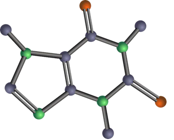
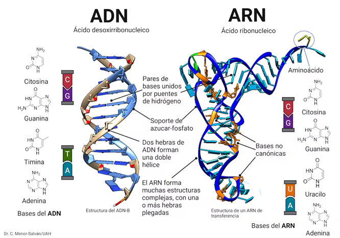
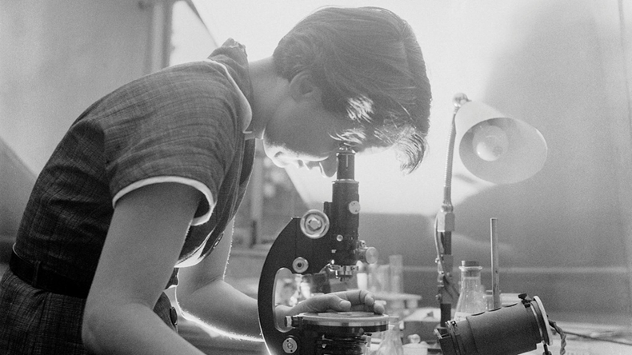
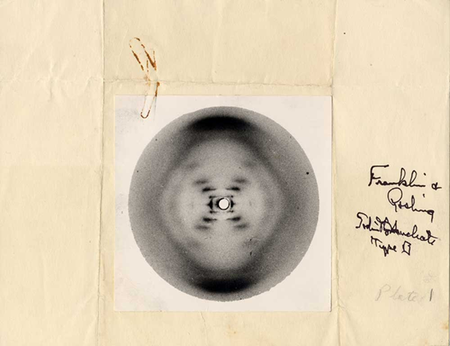
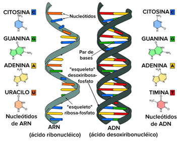
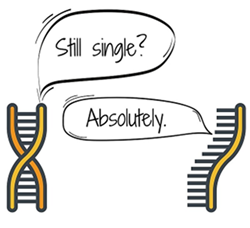

# Tema 1 · ADN y ARN. Secuencias biológicas y modelos matemáticos

## 1. Introducción
El estudio de los ácidos nucleicos —ADN y ARN— constituye la base de la bioinformática, ya que estos son los portadores y reguladores de la información genética. Comprender su estructura, función y representación matemática es fundamental para el análisis de secuencias biológicas y para el desarrollo de modelos predictivos en biología computacional.

---

## 2. El origen de la vida
El origen de las moléculas biológicas ha sido objeto de múltiples hipótesis científicas. Entre las más relevantes se encuentran:

- **Abiogénesis**: la vida surge a partir de materia inorgánica bajo condiciones específicas.
- **Panspermia**: la vida pudo tener un origen extraterrestre y llegar a la Tierra en forma de esporas o compuestos orgánicos.
- **Hipótesis del mundo de ARN (RNA World Hypothesis)**: propone que el ARN, al tener capacidades catalíticas y de almacenamiento de información, fue la primera molécula biológica fundamental.
- **Teoría de la sopa primordial**: sostiene que, en un océano primitivo, la energía procedente de radiación UV o descargas eléctricas permitió la formación de moléculas orgánicas simples.
- **Teoría de las fuentes hidrotermales**: plantea que la vida pudo originarse en sistemas ricos en energía en el fondo marino.
- **Teoría de Oparin-Haldane**: describe un proceso gradual de evolución química, desde moléculas simples hasta sistemas prebióticos cada vez más complejos.

Estas teorías buscan explicar cómo se pasó de compuestos químicos sencillos a sistemas capaces de autorreplicarse y evolucionar.

---

## 3. Moléculas y macromoléculas
La química de la vida se fundamenta en la combinación de moléculas simples para formar macromoléculas complejas.

- **Moléculas pequeñas**: ejemplos como etanol (C₂H₅OH), glucosa (C₆H₁₂O₆) o ácido fosfórico (H₃PO₄).
- **Macromoléculas**: largas cadenas poliméricas, como la celulosa o las proteínas.

- **Ácidos nucleicos**: ADN y ARN son polímeros de nucleótidos, cuyas unidades básicas están formadas por:
    - Una base nitrogenada (A, T/U, G, C).
    - Una pentosa (desoxirribosa en ADN, ribosa en ARN).
    - Un grupo fosfato.

La organización secuencial de nucleótidos es lo que constituye la “secuencia biológica” y contiene la información genética.

---

## 4. Descubrimiento de la estructura del ADN
El papel de **Rosalind Franklin**, con su célebre “Foto 51” obtenida por difracción de rayos X, fue esencial para determinar la estructura helicoidal del ADN. Este hallazgo permitió a Watson y Crick proponer el modelo de la **doble hélice**, que explica cómo se almacena y transmite la información genética.

*Rosalind Franklin*

*Foto 51*

---

## 5. Secuencias biológicas
Una secuencia biológica es la disposición ordenada de nucleótidos en una cadena de ADN o ARN. Estas secuencias:
- Codifican genes y elementos regulatorios.
- Son comparables entre especies para identificar homología y evolución.
- Se almacenan y analizan en bases de datos bioinformáticas.

La bioinformática utiliza algoritmos y modelos matemáticos para alinear, comparar y predecir funciones a partir de secuencias.

Cada organismo vivo tiene su propio conjunto de secuencias de ADN y ARN únicas. Estas secuencias son como un libro de instrucciones para la síntesis de proteínas y otras funciones celulares. Sin embargo, las secuencias biológicas también exhiben una sorprendente diversidad, incluso entre especies relacionadas. Esto ha llevado a un profundo interés en la identificación y comparación de secuencias genéticas.

Cada organismo vivo tiene su propio conjunto de secuencias de ADN y ARN únicas. Estas secuencias son como un libro de instrucciones para la síntesis de proteínas y otras funciones celulares. Sin embargo, las secuencias biológicas también exhiben una sorprendente diversidad, incluso entre especies relacionadas. Esto ha llevado a un profundo interés en la identificación y comparación de secuencias genéticas.

---

## 6. Modelos matemáticos de secuencias
Los modelos matemáticos permiten formalizar y analizar las secuencias biológicas:

- **Modelos probabilísticos**: como las **cadenas de Markov**, que describen la probabilidad de aparición de un nucleótido en función de sus vecinos.
- **Modelos estadísticos**: permiten calcular frecuencias de bases, identificar motivos y regiones conservadas.
- **Modelos algorítmicos**: aplicados en alineamiento de secuencias, detección de genes y construcción de árboles filogenéticos.
- **Modelos de predicción estructural**: aproximaciones computacionales que conectan secuencia y estructura.

La representación matemática abre la puerta a una comprensión más profunda de los procesos de **replicación, transcripción y traducción**, esenciales para el flujo de información genética.

---

## 7. Conclusión
El estudio del ADN y ARN, desde su origen hasta su modelado matemático, proporciona las herramientas conceptuales y prácticas necesarias para la bioinformática moderna. Este primer bloque sienta las bases para comprender cómo la información genética puede analizarse, representarse y predecirse con métodos computacionales.

 **[Ejercicio1](ejercicios_adn_arn_interactivo.md)**.
