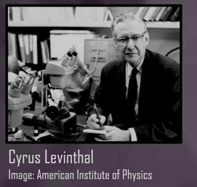
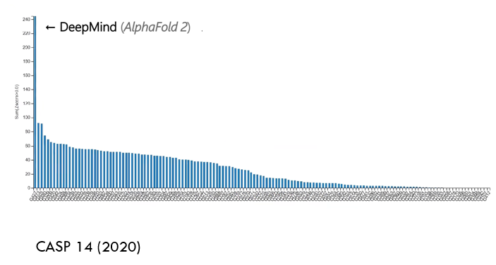

# AlphaFold — Inteligencia Artificial y el Plegamiento de Proteínas

El **plegamiento de proteínas** ha sido durante décadas uno de los mayores desafíos de la biología estructural.  
Comprender cómo una secuencia lineal de aminoácidos adopta su forma tridimensional funcional no solo es una cuestión teórica, sino la clave para entender **cómo funcionan las proteínas** y cómo sus alteraciones pueden provocar **enfermedades**.  

El proyecto **AlphaFold**, desarrollado por **DeepMind**, ha supuesto una **revolución científica** al resolver este problema utilizando **inteligencia artificial**.  
Por primera vez, un modelo computacional ha alcanzado una **precisión comparable a la obtenida por experimentos** de laboratorio como la cristalografía de rayos X o la criomicroscopía electrónica.

---

## Introducción

Predecir la estructura tridimensional de una proteína a partir de su secuencia de aminoácidos —el llamado **problema del plegamiento de proteínas**— es uno de los grandes retos de la biología moderna.  
Este desafío, formulado en los años 60, combina aspectos de **bioquímica, física y computación**, y hasta hace poco se consideraba casi imposible de resolver de forma general.

El desarrollo de **AlphaFold**, presentado por **DeepMind (Google)**, marcó un antes y un después en la bioinformática estructural:  
un sistema de inteligencia artificial capaz de predecir **estructuras con precisión atómica**, cambiando la forma en que entendemos la biología molecular.

---

## Antecedentes del problema del plegamiento

El **problema del plegamiento** puede resumirse así:  
> Dada la secuencia de aminoácidos de una proteína, ¿cómo determinar su estructura tridimensional nativa?

El **dilema de Levinthal** (1969) planteó que una proteína no puede probar todas las conformaciones posibles al azar, ya que el número de configuraciones es astronómico.  
Por tanto, debe existir una “ruta” guiada hacia el plegamiento correcto.

Durante décadas, los científicos intentaron resolver este problema mediante:
- **Modelado por homología:** comparación con estructuras conocidas.  
- **Métodos de *threading* y *ab initio*.**  
- **Simulaciones de dinámica molecular** (MD).  

Aunque útiles, estos métodos eran **lentos y limitados en precisión**, especialmente para proteínas sin homólogos estructurales.

---

## Los primeros avances experimentales

Antes de la era de la IA, las estructuras proteicas se determinaban experimentalmente mediante:

- **Cristalografía de rayos X**: método más extendido durante el siglo XX.  
- **Resonancia magnética nuclear (RMN):** útil para proteínas pequeñas.  
- **Criomicroscopía electrónica (Cryo-EM):** revolucionó el campo a partir de 2015.

*Cristalografía de rayos X*

*Criomicroscopía electrónica*

Todas estas técnicas son **costosas y laboriosas**, por lo que el número de estructuras resueltas crecía lentamente.  
Mientras tanto, las secuencias de proteínas en bases de datos como **UniProt** se contaban por millones.  

El resultado: una brecha creciente entre **secuencias conocidas** y **estructuras resueltas**.

---

## [CASP](https://predictioncenter.org/index.cgi): la evaluación del plegamiento de proteínas

Para evaluar los avances en predicción estructural, en 1994 se creó la competición **CASP (Critical Assessment of Structure Prediction)**.  

*CASP línea temporal*

Cada dos años, grupos de investigación de todo el mundo predicen estructuras de proteínas **a ciegas**, comparándose luego con las estructuras reales obtenidas experimentalmente.

Durante años, los métodos tradicionales alcanzaban **precisiones limitadas** (errores de varios angstroms).  
Esto cambió radicalmente con la llegada de **AlphaFold**.

- **CASP13 (2018):** la primera versión de AlphaFold obtiene resultados muy superiores al resto.  
- **CASP14 (2020):** **AlphaFold 2** logra una precisión media de **1 Å**, equivalente a los métodos experimentales.  
Los jueces calificaron este resultado como *“un avance histórico en la biología estructural”*.
- **CASP15 (2022):** la edición posterior confirma la **consolidación de AlphaFold2** como el estándar en predicción estructural.  
  Surgen nuevos modelos alternativos como **RoseTTAFold** (Baker Lab) y **ESMFold** (Meta AI), que replican y amplían su enfoque.
- **CASP16 (2024):** se observa una nueva tendencia hacia la **predicción de complejos multiméricos y ensamblajes macromoleculares**.  
  Modelos como **AlphaFold-Multimer** y **OpenFold** muestran avances significativos en la predicción de **interacciones proteína-proteína** y **dinámicas conformacionales**.  

En conjunto, las sucesivas ediciones de CASP demuestran cómo la inteligencia artificial ha transformado por completo el campo de la biología estructural, marcando el paso de la predicción individual a la **modelización integral de sistemas moleculares**.

*CASP predicción*

*CASP evolución, llega DeepMind AlphaFold*

*CASP evolución AlphaFold2*

---

## DeepMind y el nacimiento de AlphaFold

### Origen de DeepMind
**DeepMind** fue fundada en Londres en 2010 por **Demis Hassabis**, **Shane Legg** y **Mustafa Suleyman**.  
Su visión inicial era combinar **neurociencia, aprendizaje automático e inteligencia artificial** para crear sistemas que pudieran aprender de forma general.  
En 2014, la empresa fue adquirida por **Google**, pasando a formar parte del ecosistema de **Alphabet**.

DeepMind se hizo mundialmente conocida por crear **AlphaGo**, la IA que derrotó al campeón mundial de Go, y posteriormente por aplicar sus técnicas al ámbito científico con **AlphaFold**.

### El equipo de AlphaFold
El proyecto fue dirigido por **Demis Hassabis** junto a **John Jumper**, **Kathryn Tunyasuvunakool**, **Richard Evans** y **Pushmeet Kohli**, entre otros.  
El equipo combinó expertos en **biología estructural**, **física computacional**, **estadística**, **aprendizaje profundo** y **visualización 3D**. 

*Demis Hassabis y John Jumper*

Su objetivo era ambicioso:  
> “Usar la inteligencia artificial para resolver uno de los grandes misterios de la biología: cómo se pliegan las proteínas”.

---

## Principios del funcionamiento de AlphaFold

AlphaFold predice la estructura 3D de una proteína **a partir de su secuencia de aminoácidos** utilizando redes neuronales profundas.  
Su enfoque se basa en dos pilares:
1. **Evidencia evolutiva** (a partir de múltiples secuencias relacionadas).  
2. **Aprendizaje profundo de relaciones geométricas** entre residuos de aminoácidos.

### AlphaFold 1 (CASP13, 2018)
- Usó **redes neuronales convolucionales** para analizar **alineamientos múltiples de secuencias (MSA)**.  
- Predijo **distogramas de distancias** entre pares de residuos.  
- Ensambló estructuras mediante un proceso de optimización energética.  
- Ya superó ampliamente a todos los métodos existentes.

### AlphaFold 2 (CASP14, 2020)
- Introdujo una **arquitectura completamente nueva**, basada en **transformers** (similar a los modelos de lenguaje como GPT).  
- Aprendió directamente las relaciones espaciales y angulares entre residuos.  
- Implementó un modelo **end-to-end**, capaz de predecir directamente las coordenadas atómicas.  
- Obtuvo una precisión comparable a los experimentos de rayos X.

---

## Componentes clave del modelo AlphaFold 2

| Componente | Función |
|-------------|----------|
| **MSA (Multiple Sequence Alignment)** | Extrae información evolutiva sobre qué residuos coevolucionan. |
| **Distogramas** | Representan probabilidades de distancia entre pares de residuos. |
| **Estructura geométrica 3D** | Predicción directa de coordenadas atómicas. |
| **Módulo de atención (Transformer)** | Captura dependencias a larga distancia entre residuos. |
| **Refinamiento estructural** | Ajusta la estructura final minimizando la energía del sistema. |

El modelo se entrenó con miles de estructuras del **Protein Data Bank (PDB)** y fue validado rigurosamente en CASP14.

---

## Impacto científico y aplicaciones

En 2021, DeepMind y **EMBL-EBI** publicaron la **AlphaFold Protein Structure Database (AFDB)**, un repositorio gratuito con millones de estructuras predichas.

### Impactos principales
- Más de **200 millones de proteínas predichas**, cubriendo casi todo el catálogo biológico conocido.  
- Acceso libre y abierto para toda la comunidad científica.  
- Aceleración de:
  - **Descubrimiento de fármacos.**  
  - **Diseño de enzimas y proteínas artificiales.**  
  - **Estudios evolutivos y comparativos.**  
  - **Análisis estructural en proteómica y genómica funcional.**

AlphaFold ha transformado la forma en que los científicos **visualizan y comprenden la biología**.

---

## Limitaciones y desafíos

A pesar de su enorme éxito, AlphaFold presenta limitaciones:

- No predice **interacciones proteína-proteína** o complejos grandes (resuelto parcialmente por *AlphaFold-Multimer*).  
- No modela **dinámicas temporales** o estados alternativos de plegamiento.  
- Su precisión depende de la calidad de los **alineamientos MSA**.  
- Dificultades con **regiones desordenadas** o con alta flexibilidad estructural.

El futuro apunta a combinar AlphaFold con simulaciones de **dinámica molecular** y modelos de IA generativa para explorar la **flexibilidad y las transiciones conformacionales** de las proteínas.

---

[AlphaFold](../../files/jumper-lecture.pdf)

---

## El futuro de la predicción estructural

La revolución de AlphaFold ha inspirado numerosos proyectos derivados:

| Proyecto | Enfoque principal |
|-----------|-------------------|
| **AlphaFold-Multimer** | Predicción de complejos proteicos. |
| **ESMFold (Meta AI)** | Modelado rápido basado en modelos de lenguaje de proteínas. |
| **RoseTTAFold (Baker Lab)** | Sistema abierto inspirado en la arquitectura de AlphaFold. |
| **OmegaFold / OpenFold** | Implementaciones abiertas y optimizadas. |

La combinación de **IA + biología estructural** está permitiendo avanzar hacia un futuro donde las proteínas puedan **diseñarse racionalmente** para aplicaciones médicas, industriales o ambientales.

### AlphaFold-Multimer y los nuevos modelos post-CASP16

Desde 2022, la comunidad científica ha continuado expandiendo las capacidades de AlphaFold hacia un objetivo más ambicioso:  
**predecir no solo proteínas individuales, sino también complejos y ensamblajes moleculares completos**.

#### AlphaFold-Multimer
- Desarrollado por DeepMind como extensión directa de AlphaFold2.  
- Permite predecir **interacciones proteína-proteína** y **estructuras de complejos multimericos**.  
- Utiliza la misma arquitectura de red neuronal, pero con modificaciones en la etapa de **atención cruzada** para capturar dependencias entre distintas cadenas.  
- En **CASP16 (2024)** demostró un rendimiento muy superior a los enfoques tradicionales de acoplamiento molecular (docking).  
- Ha sido utilizado para estudiar **complejos inmunológicos**, **ensamblajes ribonucleoproteicos** y **interacciones virales**.

#### OpenFold
- Proyecto **de código abierto** impulsado por **a colaboraciones académicas y empresariales** (Harvard, Columbia, Meta AI).  
- Reproduce fielmente la arquitectura de AlphaFold2 bajo licencia abierta, promoviendo la **reproducibilidad científica**.  
- Su implementación optimiza el entrenamiento distribuido y permite la adaptación a nuevas bases de datos estructurales.

#### ESMFold (Meta AI)
- Desarrollado por el equipo de Meta AI (FAIR).  
- A diferencia de AlphaFold, no requiere alineamientos múltiples (MSA), sino que emplea un **modelo de lenguaje de proteínas** entrenado sobre **billones de secuencias** (modelo ESM-2).  
- Ofrece **predicciones ultrarrápidas** con una precisión ligeramente menor, lo que lo hace ideal para exploración a gran escala.

#### RoseTTAFold 2.0
- Creado por el laboratorio de **David Baker (University of Washington)**.  
- Combina aprendizaje profundo con principios físicos y experimentales de diseño proteico.  
- Permite la **predicción conjunta de secuencia y estructura**, abriendo el camino al **diseño generativo de proteínas** (*protein design*).

---

### Perspectiva global tras CASP16

Los avances presentados en **CASP16 (2024)** evidencian una transición hacia una nueva era:
- De la predicción individual al **modelado de sistemas moleculares completos**.  
- De la estructura estática a la **predicción dinámica** y de estados conformacionales alternativos.  
- De la IA predictiva a la **IA generativa**, capaz de diseñar proteínas con funciones nuevas.

El futuro de la biología estructural se perfila como una **sinergia entre inteligencia artificial, simulaciones físicas y biología experimental**, donde el plegamiento ya no será solo un problema a resolver, sino una **herramienta creativa para la biotecnología y la medicina personalizada**.

---

## Conclusiones

- **AlphaFold** ha resuelto un problema científico que llevaba más de 50 años abierto.  
- Su impacto se extiende más allá del plegamiento: ha redefinido la biología estructural como ciencia de datos.  
- La apertura de la **AlphaFold Database** democratiza el acceso al conocimiento estructural.  
- Este logro demuestra que la **inteligencia artificial**, cuando se integra con el conocimiento biológico, puede acelerar el descubrimiento científico a una escala sin precedentes.

---

## Biografía breve: Demis Hassabis y el equipo de DeepMind

**Demis Hassabis (n. 1976, Londres)** es neurocientífico, programador y fundador de **DeepMind**.  
Fue un niño prodigio del ajedrez, graduado en ciencias de la computación por Cambridge y doctor en neurociencia cognitiva por UCL.  
Su visión ha sido siempre la misma:  
> “Construir inteligencia artificial para avanzar en la comprensión de la mente y del universo”.

Bajo su dirección, **DeepMind** ha impulsado proyectos emblemáticos como:
- **AlphaGo** (2016): primera IA que vence a un campeón mundial humano.  
- **AlphaZero**: generalización a múltiples juegos estratégicos.  
- **AlphaFold**: aplicación de IA para resolver el plegamiento de proteínas.

El equipo de AlphaFold incluye científicos destacados como **John Jumper**, **Kathryn Tunyasuvunakool**, **Richard Evans**, **Pushmeet Kohli** y **Ellen Clancy**, entre otros.

---

