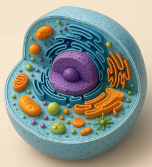
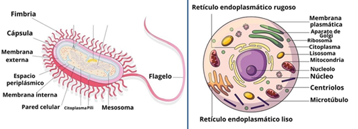
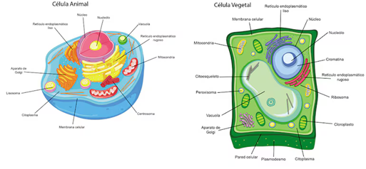
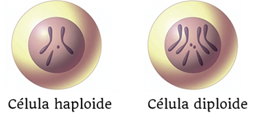
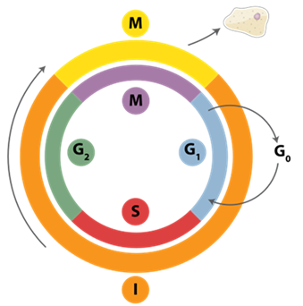
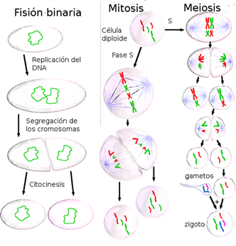

# La célula

La **célula** es la unidad fundamental de la vida. Todos los organismos vivos están formados por células, desde los más simples (como las bacterias) hasta los más complejos (como los seres humanos). A pesar de su enorme diversidad, todas las células comparten principios comunes: contienen material genético, poseen estructuras que les permiten generar energía y mantener su organización interna, y son capaces de reproducirse.

Podemos pensar en la célula como una “fábrica” en miniatura: el núcleo sería la oficina central donde se almacena la información y se toman las decisiones; las mitocondrias, las centrales energéticas; el retículo endoplasmático y el aparato de Golgi, las líneas de producción y distribución; y la membrana plasmática, la frontera que regula la entrada y salida de materiales.

*Representación 3D de una célula*

---

## Principales características
- **Unidad básica de vida:** constituye la mínima estructura capaz de realizar de manera autónoma las funciones vitales.  
- **Metabolismo propio:** realizan reacciones bioquímicas que les permiten transformar nutrientes en energía y biomoléculas.  
- **Información genética:** almacenan ADN, que dirige la actividad celular y se transmite a la descendencia.  
- **Reproducción:** pueden dividirse, ya sea por mitosis, meiosis o fisión binaria.  
- **Adaptabilidad:** responden a estímulos externos, se comunican con otras células y se adaptan a cambios ambientales.  

---

## Organización celular

### Procariotas
- Carecen de núcleo definido: el ADN se encuentra en el citoplasma, en una región llamada nucleoide.  
- Son más pequeñas y sencillas estructuralmente que las eucariotas.  
- No poseen orgánulos membranosos complejos, aunque sí estructuras como ribosomas, membrana plasmática y, en muchos casos, pared celular.  
- Ejemplos: bacterias y arqueas.  

### Eucariotas
- Presentan un núcleo delimitado por una membrana nuclear donde se almacena el ADN.  
- Tienen orgánulos especializados (mitocondrias, retículo endoplasmático, lisosomas, cloroplastos en vegetales).  
- Suelen ser de mayor tamaño y complejidad.  
- Ejemplos: células animales, vegetales, fúngicas y protistas.

  
💡 Endosimbiósis 

Es un proceso evolutivo en el que una célula vive dentro de otra estableciendo una relación de beneficio mutuo (simbi = vivir juntos, endo = dentro).

<strong>Endosimbiósis mitocondrial:</strong>

Una célula eucariota primitiva engulló una bacteria aerobia (alfa-proteobacteria).

Esa bacteria se convirtió en la mitocondria, encargada de producir energía (ATP).

<strong>Endosimbiósis cloroplástica:</strong>

Una célula eucariota engulló una cianobacteria fotosintética.

sa cianobacteria se transformó en el cloroplasto, responsable de la fotosíntesis en plantas y algas.

---

## Tipos de células eucariotas

### Células animales
- No poseen pared celular ni cloroplastos.  
- Su membrana plasmática es flexible, lo que favorece formas diversas y dinámicas.  
- Tienen centriolos (implicados en la división celular) y numerosos lisosomas (orgánulos digestivos).  

### Células vegetales
- Poseen pared celular rígida de celulosa que les da soporte y forma definida.  
- Contienen cloroplastos, orgánulos especializados en la fotosíntesis.  
- Presentan grandes vacuolas que almacenan agua, nutrientes y desechos.  

---

## Según el número de juegos cromosómicos
- **Haploides (n):** contienen un único juego de cromosomas (ej.: gametos como óvulos y espermatozoides).  
- **Diploides (2n):** poseen dos juegos de cromosomas, uno heredado de cada progenitor (ej.: células somáticas en la mayoría de organismos multicelulares).

---

## Funciones vitales de la célula
1. **Nutrición y metabolismo:** obtienen energía y materiales para mantenerse activas.  
2. **Síntesis de biomoléculas:** producen proteínas, lípidos, ácidos nucleicos y otras moléculas esenciales.  
3. **Comunicación celular:** se envían señales químicas y eléctricas para coordinar funciones en organismos multicelulares.  
4. **Reproducción:** aseguran la continuidad de la vida a través de división celular.  
5. **Evolución:** las mutaciones en el ADN celular son la base de la variabilidad genética y la evolución biológica.  

---

## La célula en el contexto del Dogma Central
La célula es el escenario donde ocurre el **dogma central de la biología molecular**:  
- El ADN se **replica** para asegurar la herencia genética.  
- El ADN se **transcribe** en ARN como paso intermedio de expresión.  
- El ARN se **traduce** en proteínas, las moléculas que llevan a cabo la mayor parte de las funciones celulares.  

Por tanto, entender la organización y funciones celulares es el primer paso para comprender cómo se regula y se transmite la información genética.  

---

## Importancia en bioinformática
La bioinformática nos permite analizar a gran escala la información celular en diferentes niveles:  
- **Genómica:** estudio del ADN y sus variaciones.  
- **Transcriptómica:** análisis de los ARN expresados en distintos tipos celulares.  
- **Proteómica:** identificación de proteínas y sus interacciones.  
- **Metabolómica:** caracterización de las rutas metabólicas.  

Estos enfoques computacionales son esenciales para comprender la célula como un sistema complejo y dinámico, y para aplicar ese conocimiento en biomedicina, biotecnología y ciencia de datos.

---

> **Para reflexionar:** si la célula fuera una empresa tecnológica, ¿qué papel desempeñaría el núcleo, qué función tendrían las mitocondrias y cómo podríamos entender la comunicación celular en términos de redes distribuidas?

  
💡 Reflexión 

Si la célula fuera una empresa tecnológica:

El <strong>núcleo</strong> sería el departamento de I+D y dirección general: almacena la información estratégica (ADN) y decide qué instrucciones se ejecutan.

Las <strong>mitocondrias</strong> actuarían como la central eléctrica de la empresa, garantizando el suministro energético necesario para que los demás departamentos funcionen.

La <strong>comunicación celular</strong> equivaldría a las redes distribuidas y los sistemas de mensajería interna: permiten coordinar procesos entre distintas <i>sucursales</i> (células) y responder rápidamente a los cambios en el entorno.

## El ciclo celular

El **ciclo celular** es el conjunto de etapas que atraviesa una célula desde que se forma hasta que se divide en dos células hijas. Se divide en dos fases principales:

### Interfase (I)  
Corresponde al período de crecimiento y preparación de la célula para dividirse. Aunque no se ve al microscopio tanta actividad como en la mitosis, es la fase donde ocurren procesos esenciales, incluido el copiado del ADN.  

- **G1 (Gap 1):** la célula crece, sintetiza proteínas y se prepara para la replicación.  
- **S (Síntesis):** se produce la **replicación del ADN**, generando dos copias idénticas de la información genética.  
- **G2 (Gap 2):** la célula continúa creciendo, repara posibles errores en el ADN replicado y se prepara para la mitosis.  

### Fase M (Mitosis)  
Es la división celular propiamente dicha, en la que el material genético (ya duplicado) se reparte equitativamente entre las dos células hijas. Incluye varias subfases (profase, metafase, anafase y telofase), seguidas de la **citocinesis** (división del citoplasma).

*Figura: Fases de la división celular*

## División celular: tres estrategias

La división celular es un proceso esencial para la vida, ya que permite la reproducción de los organismos, el crecimiento y la renovación de tejidos. Existen diferentes mecanismos según el tipo de célula y organismo: **fisión binaria**, **mitosis** y **meiosis**.

### Fisión binaria
- Propia de organismos **procariotas** (bacterias y arqueas).  
- El ADN se **replica** y se fija a diferentes regiones de la membrana.  
- La célula se alarga, los cromosomas se segregan y finalmente ocurre la **citocinesis**, dando lugar a dos células hijas genéticamente idénticas.  
👉 Es un mecanismo simple y rápido, ideal para la reproducción asexual.  

#### Mitosis
- Ocurre en células **eucariotas somáticas** (no sexuales).  
- Antes de dividirse, durante la **fase S del ciclo celular**, el ADN se **duplica**.  
- En la mitosis, los cromosomas se condensan y se reparten equitativamente entre dos núcleos hijos (profase, metafase, anafase y telofase).  
- Finalmente, la **citocinesis** genera dos células hijas **diploides**, genéticamente idénticas a la célula original.  
👉 Es fundamental para el crecimiento, reparación de tejidos y reproducción asexual en organismos multicelulares.  

#### Meiosis
- Es exclusiva de células **sexuales (germinales)**.  
- Incluye **dos divisiones sucesivas** tras una única replicación del ADN:  
  - En la **meiosis I**, se separan los cromosomas homólogos.  
  - En la **meiosis II**, se separan las cromátidas hermanas.  
- El resultado son **cuatro células haploides** (gametos), cada una con la mitad del número de cromosomas.  
👉 Este proceso es la base de la reproducción sexual, ya que genera variabilidad genética a través de la recombinación y la segregación independiente.  

---

  

*Figura: comparación entre los mecanismos de división celular. A la izquierda, la fisión binaria en procariotas; en el centro, la mitosis en células somáticas; y a la derecha, la meiosis en células germinales.*
