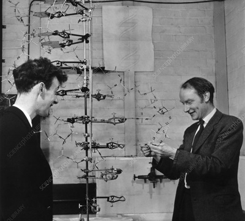

# El descubrimiento de la estructura del ADN

## Introducción
La identificación de la estructura del ADN es uno de los hitos más relevantes en la historia de la biología y la medicina. Comprender cómo se organiza esta molécula permitió explicar el mecanismo de la herencia biológica y abrió el camino a la biología molecular moderna.

## Contexto histórico
A principios del siglo XX, ya se sabía que el ADN estaba relacionado con la herencia genética, pero su estructura interna seguía siendo un misterio. Durante la década de 1950, varios grupos de investigación en Europa y Estados Unidos competían por resolver el enigma.

## Rosalind Franklin y Maurice Wilkins
En el King's College de Londres, **Rosalind Franklin** y **Maurice Wilkins** trabajaban en el análisis del ADN mediante difracción de rayos X.  
- Franklin era una experta en cristalografía y consiguió obtener imágenes de altísima calidad de fibras de ADN.  
- Su famosa **Fotografía 51**, obtenida en 1952, mostró un patrón en forma de X que sugería una estructura helicoidal.  
- Wilkins, colega suyo, mantenía una relación complicada con Franklin, pero también contribuyó a la investigación con estudios de difracción.

## Watson y Crick
En la Universidad de Cambridge, **James Watson** y **Francis Crick** intentaban construir modelos moleculares basados en los datos disponibles.  
- Sin acceso directo a las mejores imágenes, dependían de información publicada o compartida de manera indirecta.  
- A principios de 1953, tras conocer (sin el consentimiento de Franklin) la Fotografía 51 gracias a Wilkins, tuvieron la pista definitiva para confirmar la estructura.

## El modelo de la doble hélice
En abril de 1953, Watson y Crick publicaron en *Nature* su 
**[célebre artículo](01_Watson-Crick-Nature1953-2_GeneticImplications.pdf)** describiendo la **doble hélice del ADN**:  
- Dos cadenas antiparalelas enrolladas en espiral.  
- Bases nitrogenadas enfrentadas y unidas por puentes de hidrógeno (A con T, C con G).  
- Una estructura que permitía explicar de manera elegante la replicación genética.

*Crick y Watson con su modelo de ADN en 1953*

## Reconocimiento y controversia
En 1962, **Watson, Crick y Wilkins** recibieron el **Premio Nobel de Fisiología o Medicina** por el descubrimiento de la estructura del ADN. Rosalind Franklin no fue reconocida, ya que había fallecido en 1958 a los 37 años, y el Nobel no se concede de manera póstuma.  

Hoy en día, se reconoce ampliamente que el trabajo de Franklin fue **esencial y decisivo**, y su contribución forma parte inseparable de la historia de este descubrimiento.

## Conclusión
El hallazgo de la doble hélice no fue el resultado del trabajo aislado de unos pocos, sino de una red de esfuerzos complementarios y, a veces, conflictivos. La historia de Franklin, Wilkins, Watson y Crick es un ejemplo de la complejidad del quehacer científico y de la importancia de reconocer justamente todas las contribuciones.
