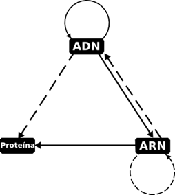
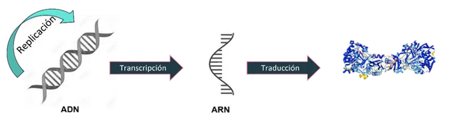

# Dogma Central de la Biología Molecular

## Introducción
El **dogma central de la biología molecular**, formulado por Francis Crick en 1958, describe el flujo unidireccional de la información genética en los organismos vivos:

**ADN → ARN → Proteína**

**La información genética se almacena en el ADN**

**Se transcribe en ARN mensajero (ARNm)**

El ARNm se traduce en proteínas, que son las moléculas funcionales responsables de la estructura y la función celular.

Este dogma explica cómo la información hereditaria se utiliza para construir los componentes esenciales de la vida. Aunque posteriormente se han descubierto excepciones (como la transcriptasa inversa en retrovirus, ARN → ADN), el esquema sigue siendo la base de la biología molecular.

*Dogma Central de la Biología Molecular*

 Detalles

Las<strong> líneas continuas</strong> muestran el flujo clásico de información genética (el dogma original).

Las<strong>líneas discontinuas</strong> muestran rutas especiales descubiertas posteriormente.

Casos especiales

<strong>ARN --> ADN</strong>

- Descubierto en retrovirus (ej. VIH).

- Se debe a la enzima transcriptasa inversa, que permite generar ADN a partir de ARN.

- Ejemplo aplicado: técnicas de RT-PCR en biología molecular.

<strong>ARN --> ARN</strong>

- Algunos virus de ARN pueden replicar directamente su genoma de ARN sin pasar por ADN.

- Ejemplos: virus de la gripe, virus de la polio..

<strong>proteína --> proteína</strong>

- No se trata de flujo de información genética clásica, pero sí de herencia estructural.

- Ocurre en el caso de los priones, donde una proteína mal plegada induce a otras proteínas a adoptar la misma conformación anómala (ejemplo: enfermedad de Creutzfeldt-Jakob).

## La célula

Antes de adentrarnos en los procesos de replicación, transcripción y traducción, es importante recordar el contexto en el que se desarrollan: la **célula**. Puedes revisar sus características y tipos principales en la [Célula](01_celula.md).

## Replicación - Transcripción - Traducción

**[Replicación](01_replicacion.md)**

**[Transcripción](01_transcripcion.md)**

**[Traducción](01_traduccion.md)**
