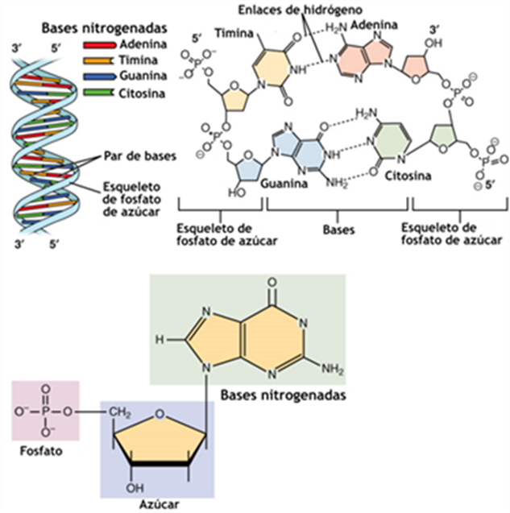

# Estructura del ADN y del ARN

## Introducción
El ácido desoxirribonucleico (ADN) y el ácido ribonucleico (ARN) son **ácidos nucleicos** formados por la polimerización de **nucleótidos**. Aunque comparten principios químicos (azúcar pentosa, base nitrogenada y fosfato), difieren en su **química fina** y en las **estructuras** que adoptan, lo que determina su **estabilidad** y **funciones** celulares.

---

## Nucleótidos y enlaces
- **Componentes**: una **pentosa** (desoxirribosa en el ADN; ribosa en el ARN), un grupo **fosfato** y una **base** (A, G, C, T/U).  
- **Enlace fosfodiéster**: une el **3’** de un nucleótido con el **5’** del siguiente, estableciendo **polaridad 5’→3’** en la cadena.  
- **Diferencia clave**: el ARN posee un **grupo 2’-OH** en la ribosa (ausente en desoxirribosa). Ese 2’-OH incrementa la **reactividad** química y favorece geometrías de **hélice A** en dúplex de ARN; además facilita el **plegamiento intramolecular** y contactos con proteínas.
- **Bases**: el ADN usa **timina (T)**; el ARN usa **uracilo (U)**. Las **parejas de bases** canónicas son **A·T(U)** y **G·C**.

*Nucleótidos. Estructura ADN*

---

## Estructura del ADN

### Doble hélice B (forma canónica)
- **Arquitectura**: dos hebras **antiparalelas** con las bases apiladas hacia el interior y el esqueleto azúcar‑fosfato hacia el exterior.  
- **Geometría característica** (valores aproximados):  
  - **~10.4–10.5 pares de bases por vuelta**.  
  - **Paso helicoidal** (pitch) de ~**3.4 nm** por vuelta y **0.34 nm** de separación entre pares de bases.  
  - **Diámetro** de ~**2.0 nm**.  
  - Presencia de **surco mayor** (ancho) y **surco menor** (estrecho), relevantes para el **reconocimiento de secuencia** por proteínas.  
- **Enlaces no covalentes**: el **apilamiento de bases** (interacciones π‑π) y los **puentes de hidrógeno** A·T(2) y G·C(3) estabilizan la hélice.  
- **Reglas de Chargaff**: la complementariedad conduce a una proporción ~1:1 de **purinas** con **pirimidinas**.

### Otras conformaciones (A y Z)
- **A‑ADN**: hélice **más corta y ancha**, con ~**11 pb/vuelta**; aparece en condiciones de **baja hidratación**.  
- **Z‑ADN**: hélice **zurda** con ~**12 pb/vuelta**, favorecida por secuencias **alternantes purina‑pirimidina** y ciertas condiciones iónicas.

### Organización superior del ADN (visión general)
- El ADN eucariota se **superenrolla** y se empaqueta en **cromatina**.  
- La **unidad básica** es el **nucleosoma**: un **octámero de histonas** alrededor del cual se enrollan **~145–147 pb** de ADN. Conjuntos de nucleosomas y **regiones linker** forman fibras y **bucles** que compactan el genoma.

---

## Estructura del ARN

### Rasgos generales
- Normalmente es **monocatenario**, pero puede formar **segmentos dúplex** por **apareamiento intramolecular**.  
- En dúplex, el ARN adopta preferentemente **geometría A** (surco mayor profundo y estrecho; surco menor ancho y somero).
- La presencia de **2’-OH** favorece **puentes de hidrógeno intramoleculares**, redes de **solvatación** y **catálisis** en ribozimas.

### Estructura secundaria (motivos frecuentes)
- **Tallos/brazos (stems)**: regiones dúplex Watson‑Crick (A·U y G·C) con **apareamientos no canónicos** frecuentes (p. ej., **G·U “wobble”**).  
- **Bucles de horquilla (hairpins)** o **stem‑loops**.  
- **Bucles internos** y **abultamientos** (bulges).  
- **Junciones** multirrama.  
Estos elementos modulan **estabilidad** y **accesibilidad**, y condicionan la **función** (traducción, splicing, regulación, etc.).

### Estructura terciaria
- **Apilamientos coaxiales**, **tripletes**, **pseudonudos** y contactos **ARN‑proteína/ion** organizan dominios 3D.  
- Ejemplos clásicos incluyen la **forma en L del tRNA** y los pliegues extensos del **rRNA**.  

---

## Comparativa rápida ADN vs ARN

| Característica | ADN | ARN |
|---|---|---|
| Azúcar | **Desoxirribosa** (sin 2’-OH) | **Ribosa** (con 2’-OH) |
| Base exclusiva | **Timina (T)** | **Uracilo (U)** |
| Catenariedad típica | **Bicatenario** | **Monocatenario** (con dúplex locales) |
| Geometría del dúplex | **B‑hélice** (10.4–10.5 pb/vuelta; 2.0 nm diámetro) | **A‑hélice** en dúplex de ARN |
| Estabilidad química | **Mayor** (menos reactivo) | **Menor** (2’-OH favorece hidrólisis y plegamiento) |
| Apareamiento no canónico | Raro | Frecuente (**G·U**, otros) |
| Empaquetamiento | **Nucleosomas** y cromatina | Complejos RNP (p. ej., **ribosomas**, **spliceosoma**) |

---

## Detalles numéricos útiles (recordatorio)
- **Separación entre pares de bases en B‑ADN**: ~**0.34 nm**.  
- **Paso por vuelta en B‑ADN**: ~**3.4 nm**.  
- **Parejas de bases**: **A·T** (**2** puentes H), **G·C** (**3** puentes H).  
- **Nucleosoma**: **~145–147 pb** de ADN alrededor de un **octámero de histonas**.

