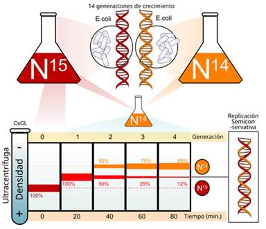
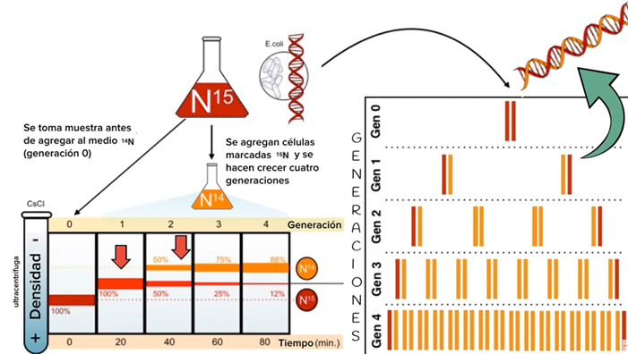

# Meselson y Stahl

### El experimento de Meselson y Stahl

Para comprobar cuál de los modelos de replicación del ADN era correcto, Matthew Meselson y Franklin Stahl diseñaron un experimento brillante en 1958. Su estrategia se basó en marcar el ADN con **isótopos de nitrógeno** y observar su distribución tras varios ciclos de replicación:

1. Cultivaron bacterias (*E. coli*) en un medio que contenía **nitrógeno pesado (^15N)**. De esta forma, todo su ADN se volvió más denso de lo habitual.  
2. Tras varias generaciones, trasladaron las bacterias a un medio con **nitrógeno ligero (^14N)**, permitiendo que el ADN nuevo se sintetizara con el isótopo ligero.  
3. A medida que las células se dividían, extrajeron el ADN y lo separaron mediante **centrifugación en gradiente de densidad**.  

Los resultados fueron reveladores:
- Tras **una ronda de replicación**, todo el ADN tenía una densidad **intermedia**, descartando el modelo conservativo.  
- Tras **dos rondas**, aparecieron moléculas con densidad intermedia y ligera, confirmando el modelo **semiconservativo**.  

Este experimento se conoce como “el experimento más bello en biología” y constituye una demostración experimental directa del modelo propuesto por Watson y Crick.

> **Conclusión:** el ADN se replica de forma **semiconservativa**, lo que garantiza que cada molécula hija conserve una hebra parental como molde para la síntesis de la nueva.
