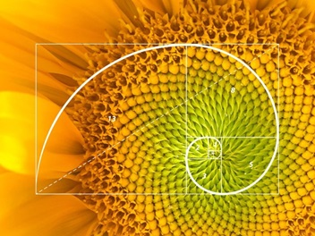
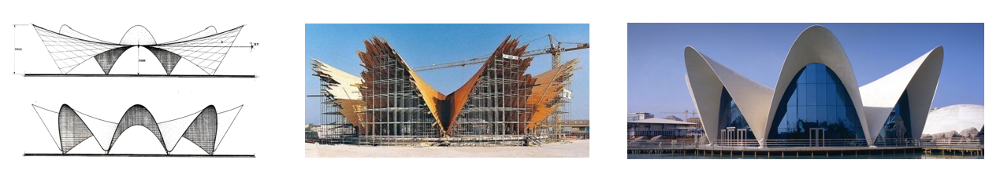
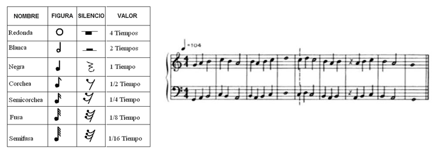
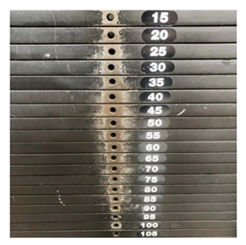

# Otros modelos

### Fibonacci
La secuencia de Fibonacci para describir la disposición de las espirales.

### El teorema del panal
El teorema del panal establece que, de todas las formas posibles con las que se podría llenar un plano con celdas de área igual, el hexágono regular es la forma que minimiza el perímetro total.
Optimización del espacio.

### Arquitectura
El uso de superficies parabólicas en arquitectura permite crear estructuras resistentes, ligeras y visualmente armónicas. 

### Música
Las figuras musicales muestran cómo las matemáticas organizan el ritmo y el tiempo en la creación de la música. 

### Interpretación de los datos
La interpretación de los datos permite transformar números en conocimiento útil para comprender la realidad y tomar decisiones.

