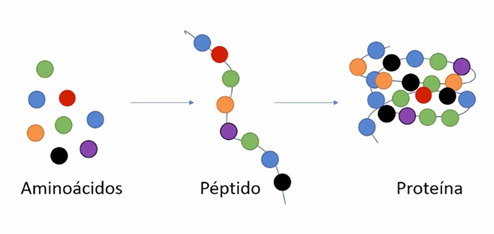

# Las proteínas

Las **proteínas** son macromoléculas fundamentales para la vida. Están formadas por largas cadenas de **aminoácidos** unidos por enlaces peptídicos, y cada cadena se pliega adoptando una estructura específica que determina su función. Son los componentes más versátiles de la célula, ya que participan en prácticamente todos los procesos biológicos.

*Polipéptidos*

---

*Cadena de aminoácidos*

*Proceso de creación*

El conjunto total de proteínas expresadas por un organismo, tejido o célula en un momento dado se conoce como **proteoma**.

## Funciones principales
Las proteínas desempeñan una enorme variedad de funciones, siendo responsables de casi todos los procesos celulares:

| Tipo de función | Ejemplo de proteínas | Descripción |
|-----------------|----------------------|--------------|
| **Estructural** | Colágeno, queratina | Forman la arquitectura de tejidos, piel, cabello y uñas. |
| **Enzimática** | Amilasa, ADN polimerasa | Catalizan reacciones bioquímicas, reduciendo la energía de activación. |
| **Transporte** | Hemoglobina, ferritina | Transportan moléculas como oxígeno, iones o metales. |
| **Reguladora** | Hormonas peptídicas (insulina), factores de transcripción | Regulan la expresión génica y los procesos metabólicos. |
| **Contráctil** | Actina, miosina | Permiten el movimiento celular y muscular. |
| **Inmunitaria** | Anticuerpos (inmunoglobulinas) | Reconocen y neutralizan patógenos. |
| **Receptora y señalizadora** | GPCRs, receptores de insulina | Transmiten señales químicas entre células. |

Cada proteína puede desempeñar varias funciones según su contexto, modificarse químicamente o asociarse con otras para formar **complejos multiproteicos**.

---

## Clasificación de las proteínas

Las proteínas pueden clasificarse según diversos criterios:

### 1. Según su composición
- **Simples:** formadas solo por aminoácidos (ej. albúmina).  
- **Conjugadas:** poseen un grupo no proteico o **cofactor** (ej. hemoglobina contiene el grupo hemo).

### 2. Según su forma
- **Fibrosas:** alargadas, insolubles y con función estructural (colágeno, queratina).  
- **Globulares:** compactas, solubles y con funciones dinámicas (enzimas, anticuerpos).

### 3. Según su localización
- **Citoplasmáticas**, **nucleares**, **de membrana**, **mitocondriales** o **secretadas**.

### 4. Según su función molecular (anotación bioinformática)
- **Catalíticas**, **transportadoras**, **reguladoras**, **estructurales** o **de defensa**, según la clasificación de la **Gene Ontology (GO)**.

---

## Estructura de las proteínas
La estructura de una proteína es jerárquica y se organiza en cuatro niveles:

1. **Estructura primaria:** la secuencia lineal de aminoácidos.  
2. **Estructura secundaria:** patrones locales de plegamiento, como hélices alfa y láminas beta.  
3. **Estructura terciaria:** la conformación tridimensional completa de la proteína, determinada por interacciones químicas entre los aminoácidos.  
4. **Estructura cuaternaria:** el ensamblaje de varias cadenas polipeptídicas en una proteína funcional.

*Hélices Alfa* Fuente: wikipedia

*Láminas Beta* Fuente: wikipedia

*Estructura de las proteínas*

---

### Insulina: un ejemplo de estructura primaria

- La **insulina** es una **hormona proteica** cuya función principal es **regular los niveles de glucosa en sangre**, facilitando la captación de glucosa por las células.

- Está formada por **dos cadenas polipeptídicas** (A y B) unidas por **puentes disulfuro**:
  - La **cadena A** tiene 21 aminoácidos.  
  - La **cadena B** tiene 30 aminoácidos.  

- Su **estructura primaria** corresponde a la **secuencia lineal de aminoácidos** codificada en el gen *INS*.  
  Esta secuencia determina su plegamiento posterior y, por tanto, su función biológica.

- Cualquier cambio en la secuencia (mutación puntual o deleción) puede **alterar la estructura tridimensional** y provocar **resistencia o deficiencia funcional** de la insulina, como ocurre en algunas formas de **diabetes monogénica**.

- La insulina fue la **primera proteína cuya secuencia completa se determinó experimentalmente** (por **Frederick Sanger**, 1955), marcando un hito en la biología molecular.

### Queratina: un ejemplo de estructura secundaria

- La **queratina** es una **proteína fibrosa** cuya estructura se basa principalmente en **hélices alfa (α)**, un tipo de **estructura secundaria** estabilizada por **puentes de hidrógeno** entre los enlaces peptídicos.

- Existen dos formas principales:
  - **Alfa-queratina**, presente en **cabello, uñas y piel**, con una estructura helicoidal flexible.  
  - **Beta-queratina**, presente en **plumas y escamas**, con disposición en **láminas beta (β)** más rígidas.

- Varias hélices de queratina se **enrollan entre sí formando filamentos** resistentes, lo que otorga **fuerza y elasticidad** a los tejidos.

- Su organización jerárquica (hélices → fibras → filamentos) ejemplifica cómo las **estructuras secundarias** pueden ensamblarse para generar **propiedades mecánicas** específicas.

### Mioglobina: un ejemplo de estructura terciaria

- La **mioglobina** es una **proteína globular** compuesta por una **única cadena polipeptídica de 153 aminoácidos**.

- Contiene un **grupo hemo**, igual que la hemoglobina, pero **no forma complejos multiméricos**: cada molécula de mioglobina actúa por sí sola.

- Su función principal es **almacenar oxígeno** en el **músculo esquelético**, liberándolo cuando el músculo lo necesita durante la contracción.

### Hemoglobina: estructura cuaternaria y función

- La **hemoglobina (Hb)** está formada por **cuatro subunidades proteicas** (por eso se considera una proteína con **estructura cuaternaria**):

  - **2 cadenas alfa (α)**  
  - **2 cadenas beta (β)**

- Cada una de esas subunidades contiene un **grupo hemo**, que tiene en su centro un átomo de **hierro (Fe²⁺)** capaz de **unirse reversiblemente al oxígeno (O₂)**.

- En conjunto, la molécula completa de hemoglobina puede transportar **cuatro moléculas de oxígeno**, una por cada grupo hemo.

---

## Curiosidades y datos interesantes

- Una célula humana contiene más de **10.000 tipos distintos de proteínas**, y el proteoma completo puede superar los **100.000 isoformas** por modificaciones postraduccionales.  
- Las proteínas pueden tener **vida media muy variable**, desde minutos (ciclina) hasta años (cristalina del ojo).  
- La **desnaturalización** (pérdida de estructura terciaria) puede ser reversible o irreversible y afecta directamente a la función.  
- El estudio de las proteínas a gran escala ha permitido **descubrir biomarcadores**, diseñar **fármacos dirigidos** y avanzar en **terapias personalizadas**.

---

[Plegamiento de proteínas](01_plegamiento.md "Plegamiento de proteínas")

---

> En resumen, las proteínas son los verdaderos "nanorrobots" de la célula: se construyen siguiendo las instrucciones del ADN y realizan las tareas necesarias para mantener la vida.
