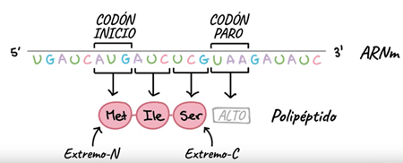
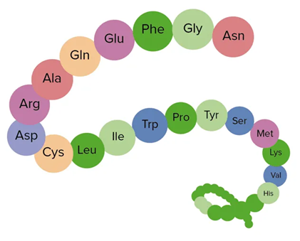

# Las proteínas

Las **proteínas** son macromoléculas fundamentales para la vida. Están formadas por largas cadenas de **aminoácidos** unidos por enlaces peptídicos, y cada cadena se pliega adoptando una estructura específica que determina su función. Son los componentes más versátiles de la célula, ya que participan en prácticamente todos los procesos biológicos.

*Polipéptidos*

---

*Cadena de aminoácidos*

## Funciones principales
Las proteínas cumplen una amplia variedad de funciones esenciales:
- **Estructurales:** forman parte del citoesqueleto, membranas y tejidos (ej.: colágeno, queratina).  
- **Enzimáticas:** catalizan reacciones químicas, acelerando los procesos metabólicos (ej.: ADN polimerasa, amilasas).  
- **Reguladoras:** actúan como hormonas y factores de transcripción que controlan la expresión génica.  
- **Defensivas:** forman parte del sistema inmune (anticuerpos).  
- **Transporte y almacenamiento:** facilitan el movimiento de moléculas (hemoglobina transporta oxígeno, ferritina almacena hierro).  

## Estructura de las proteínas
La estructura de una proteína es jerárquica y se organiza en cuatro niveles:

1. **Estructura primaria:** la secuencia lineal de aminoácidos.  
2. **Estructura secundaria:** patrones locales de plegamiento, como hélices alfa y láminas beta.  
3. **Estructura terciaria:** la conformación tridimensional completa de la proteína, determinada por interacciones químicas entre los aminoácidos.  
4. **Estructura cuaternaria:** el ensamblaje de varias cadenas polipeptídicas en una proteína funcional.

---

> En resumen, las proteínas son los verdaderos "nanorrobots" de la célula: se construyen siguiendo las instrucciones del ADN y realizan las tareas necesarias para mantener la vida.
