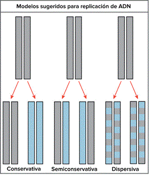
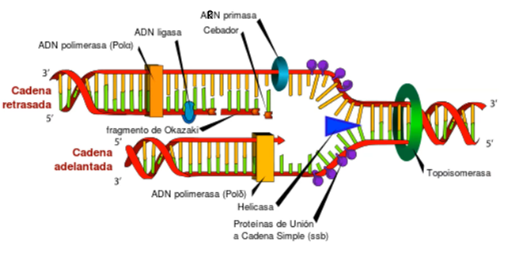
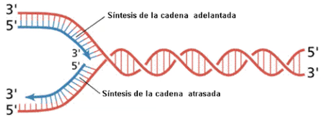
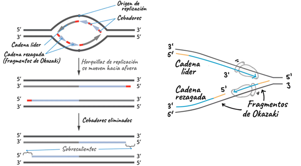
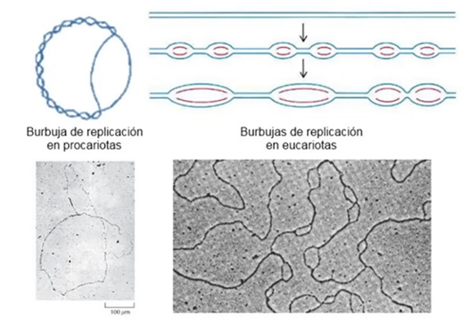

# Replicación

## Introducción

La replicación del ADN es el proceso mediante el cual una célula duplica su material genético antes de dividirse. Se basa en la complementariedad de bases, donde cada hebra parental sirve de molde para sintetizar una nueva hebra. Intervienen enzimas clave como la ADN polimerasa, helicasa y primasa, que garantizan la fidelidad y la continuidad de la secuencia. Este mecanismo es semiconservativo: cada molécula hija conserva una hebra original y una nueva. La precisión en la replicación es esencial para mantener la estabilidad genética y prevenir mutaciones.

## Modelos de replicación del ADN

Cuando se descubrió la estructura de doble hélice del ADN, una de las grandes incógnitas era cómo se copiaba la información genética. Se plantearon tres modelos teóricos:

- **Conservativo:** la molécula parental de ADN se mantiene intacta y se sintetiza una molécula completamente nueva.  
- **Semiconservativo:** cada hebra parental sirve como molde para una hebra nueva, de modo que las moléculas hijas contienen una hebra antigua y una nueva.  
- **Dispersivo:** las hebras hijas se componen de fragmentos de ADN parental y nuevo entremezclados.  

El famoso experimento de **[Meselson y Stahl (1958)](01_meselsonstahl.md)**, utilizando isótopos de nitrógeno y centrifugación en gradiente de densidad, demostró que la replicación del ADN es **semiconservativa**, tal y como predijeron Watson y Crick.

*Figura: Representación de los modelos conservativo, semiconservativo y dispersivo de replicación del ADN.*

## Replicación del ADN

La replicación del ADN es un proceso esencial para la vida, porque asegura que cada célula hija reciba una copia exacta de la información genética. Todo comienza cuando la helicasa rompe los puentes de hidrógeno entre las dos hebras del ADN, abriendo la llamada horquilla de replicación. A continuación, la primasa sintetiza pequeños fragmentos de ARN que sirven como cebadores, permitiendo a la ADN polimerasa iniciar la síntesis de nuevas hebras complementarias.

En la hebra líder, la síntesis ocurre de manera continua siguiendo la dirección de la horquilla. En cambio, en la hebra rezagada se forman los fragmentos de Okazaki, que luego son unidos por la ADN ligasa para generar una hebra continua. Este mecanismo es semiconservativo, ya que cada molécula resultante conserva una hebra original y una hebra nueva.

La precisión de este proceso es crítica: las enzimas poseen mecanismos de corrección de errores que minimizan las mutaciones. Gracias a la replicación, la información genética se transmite fielmente de generación en generación, manteniendo la estabilidad del genoma.

*Figura: Proceso de replicación*

*Figura: Representación de la síntesis de las dos cadenas*

*Figura: Proceso de replicación*

*Figura: Proceso de replicación*