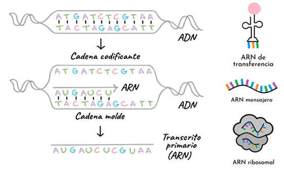
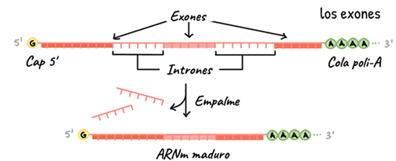
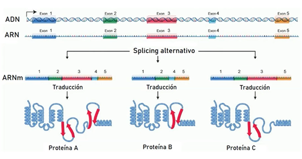
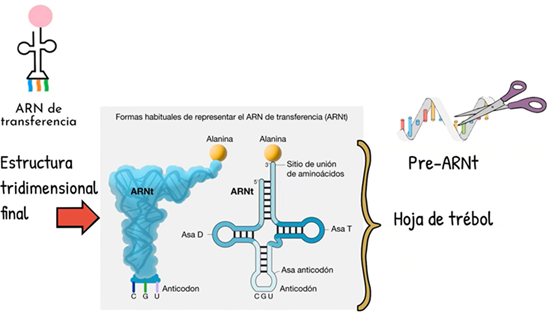
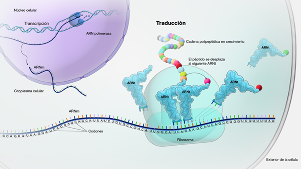

# Traducción

## Introducción

La traducción es el proceso mediante el cual la información del ARNm se convierte en una secuencia de aminoácidos, formando una proteína funcional. Ocurre en los ribosomas, donde el ARNm se lee en tripletes llamados codones, cada uno especificando un aminoácido. El ARNt actúa como adaptador, transportando los aminoácidos correspondientes y acoplándolos en el orden dictado por el ARNm. Factores de iniciación, elongación y terminación coordinan las fases de este proceso. La traducción es crucial porque enlaza la información genética con la función biológica de la célula.

## Traducción del ADN

La traducción convierte el lenguaje de los nucleótidos en el de los aminoácidos, produciendo una proteína funcional. Este proceso ocurre en los ribosomas, que se ensamblan alrededor de la molécula de ARNm. El ribosoma lee los codones de tres en tres nucleótidos, y cada uno es reconocido por un ARN de transferencia (ARNt) cargado con el aminoácido correspondiente.

La proteína se construye siguiendo tres fases: inicio, donde se coloca el primer aminoácido; elongación, en la que los ARNt van aportando nuevos aminoácidos en cadena; y terminación, que se da cuando el ribosoma encuentra un codón de parada. El resultado es una secuencia polipeptídica que posteriormente se pliega y adquiere su conformación activa. Gracias a la traducción, la información genética se transforma en función celular.

### Procesamiento del ARNm
La figura muestra cómo a partir del ADN se obtiene un **transcrito primario (ARN)**.  
La ARN polimerasa copia la **cadena molde** del ADN (3’ → 5’) para producir un ARN complementario en dirección 5’ → 3’.  
El resultado inicial es un transcrito primario que luego será procesado.  
A la derecha se representan los tres tipos principales de ARN implicados en la expresión génica: 

- **ARN mensajero (ARNm)**, que lleva la información.  
- **ARN de transferencia (ARNt)**, que aporta aminoácidos durante la traducción.  
- **ARN ribosómico (ARNr)**, que forma parte del ribosoma.  

---
### Procesamiento del transcrito primario
Esta figura representa el **procesamiento del transcrito primario** en células eucariotas.  
Incluye tres pasos fundamentales:  
- Adición de una **cap 5’**, que protege y facilita la traducción.  
- Incorporación de una **cola poli-A** en el extremo 3’, que estabiliza la molécula.  
- Eliminación de **intrones** y unión de **exones** mediante **empalme (splicing)**.  
El resultado es un **ARNm maduro**, listo para salir del núcleo hacia el citoplasma.

---

💡 Intrones - Exones

<strong> Intrones </strong>

- Son las secuencias no codificantes que aparecen intercaladas entre exones en los genes eucariotas.

- Se transcriben inicialmente al ARN pre-mensajero (pre-ARNm), pero se eliminan durante el proceso de splicing (corte y empalme).

- Aunque no codifican proteínas, los intrones no son “ADN basura”:

-- Pueden contener secuencias reguladoras que influyen en cómo y cuándo se expresan los genes. 

-- Favorecen el fenómeno de splicing alternativo, que permite generar distintas proteínas a partir de un mismo gen. 

<strong> Exones </strong>

- Son las secuencias codificantes de un gen.

- Contienen la información que, tras el proceso de transcripción y maduración del ARN, se mantendrá en el ARN mensajero (ARNm) maduro.

- Finalmente, esa información se traduce en proteínas.

- Pueden incluir no solo regiones que codifican aminoácidos, sino también algunas regiones no traducidas (UTRs) que son reguladoras. 

---

### Splicing alternativo
Aquí se ilustra el fenómeno del **splicing alternativo**, que permite generar diferentes ARNm a partir de un mismo transcrito primario.  
Dependiendo de qué exones se incluyan o excluyan, se obtienen distintas versiones de ARNm, que tras la traducción producen **proteínas diferentes** (ejemplo: proteína A, B o C).  
Este mecanismo explica la gran diversidad proteica a partir de un número limitado de genes.

---

### Estructura del ARNt
La figura muestra la estructura del **ARN de transferencia (ARNt)**.  
En su forma secundaria se representa como una **hoja de trébol**, con:  
- Un **anticodón**, que reconoce al codón complementario en el ARNm.  
- Un **sitio de unión al aminoácido** en el extremo 3’.  
En su forma tridimensional, el ARNt se pliega en una estructura compacta que facilita la entrega del aminoácido al ribosoma durante la traducción.

---

### Traducción en el ribosoma
Este esquema ilustra el proceso de **traducción** en el ribosoma.  
El **ARNm** se lee en tripletes de bases (codones), cada uno reconocido por un **ARNt** con el anticodón complementario que transporta un aminoácido específico.  
El ribosoma va enlazando los aminoácidos de manera secuencial, generando una **cadena polipeptídica en crecimiento**.  
Es el paso final de la expresión génica, en el que la información contenida en el ADN se materializa en forma de proteínas.

**[Proteína](01_proteinas.md)**

