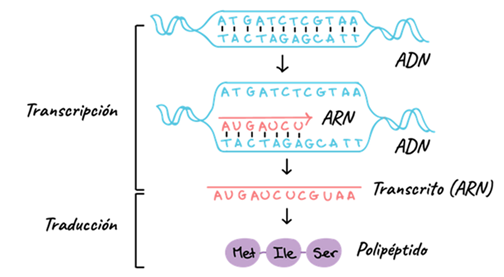
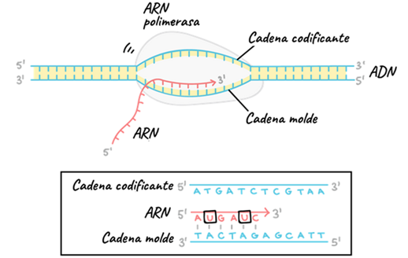

# Transcripción

## Introducción

La transcripción es el proceso por el cual la información genética contenida en el ADN se copia en forma de ARN mensajero (ARNm). Se lleva a cabo en el núcleo de las células eucariotas mediante la ARN polimerasa, que reconoce regiones promotoras y construye una cadena complementaria al molde de ADN. El resultado es un ARNm que contiene las instrucciones necesarias para la síntesis de proteínas. Este paso es altamente regulado y constituye un punto crítico para el control de la expresión génica. Además, en eucariotas el ARNm sufre modificaciones postranscripcionales antes de salir al citoplasma.

## Transcripción del ADN

La transcripción es el primer paso en la expresión génica: consiste en copiar la información del ADN a una molécula de ARN mensajero (ARNm). La ARN polimerasa se une a una región promotora y separa las hebras de ADN, usando una de ellas como molde. A medida que avanza, incorpora ribonucleótidos complementarios formando una hebra de ARN.

En eucariotas, este ARNm inicial sufre modificaciones como el cap 5’, la cola poli-A y el splicing, donde se eliminan intrones y se conservan exones. Estas transformaciones aseguran que el ARNm sea estable y esté listo para salir del núcleo hacia el citoplasma. La transcripción, por tanto, no solo copia información, sino que también regula de forma precisa qué genes se expresan y cuándo.

### Del ADN a la proteína
Esta figura representa el núcleo del **dogma central de la biología molecular**.  
Primero, en la **transcripción**, la ARN polimerasa copia la información genética de una hebra de ADN y produce un transcrito de ARN.  
Después, en la **traducción**, el ARN mensajero se lee en tripletes de bases (codones), cada uno especificando un aminoácido.  
El resultado final es un **polipéptido**, una cadena de aminoácidos que dará lugar a una proteína funcional.

---

## Elongación de la transcripción
Aquí se muestra la **fase de elongación** de la transcripción.  
La ARN polimerasa avanza sobre la hebra molde de ADN en dirección 3’ → 5’, y va incorporando nucleótidos complementarios en el ARN en crecimiento, que siempre se sintetiza en dirección **5’ → 3’**.  
Cada base de ADN determina la incorporación de la base complementaria en el ARN: A con U, T con A, C con G y G con C.

---

## Iniciación de la transcripción
La figura ilustra la **fase de iniciación**.  
La ARN polimerasa reconoce y se une a una secuencia promotora en el ADN, situada antes de la región a transcribir.  
Una vez posicionada, abre la doble hélice del ADN formando una burbuja de transcripción y utiliza una hebra como **molde de cadena sencilla** para empezar a sintetizar ARN.

---

## Cadena molde y cadena codificante
Este esquema muestra la relación entre la **cadena molde** y la **cadena codificante** del ADN durante la transcripción.  
La ARN polimerasa lee la hebra molde en dirección 3’ → 5’, produciendo un ARN complementario en dirección 5’ → 3’.  
El ARN resultante tiene la misma secuencia que la cadena codificante del ADN, salvo que la timina (T) se sustituye por uracilo (U).

---

## Terminación de la transcripción
En esta figura se representa la **fase de terminación**.  
Cuando la ARN polimerasa alcanza una secuencia de terminación, el ARN recién sintetizado forma una estructura en horquilla que provoca el cese de la transcripción.  
El ARN polimerasa se desprende del ADN y el **transcrito de ARN** es liberado, listo para su procesamiento y posterior traducción.

## Tipos de ARN y sus funciones

Existen varios tipos de ARN, cada uno con características y funciones específicas:

### 1. ARN mensajero (ARNm)

**Características**: copia de la información genética del ADN, con secuencia de codones.  
**Funciones**: transportar la información desde el núcleo hasta los ribosomas para dirigir la síntesis de proteínas.

### 2. ARN de transferencia (ARNt)

**Características**: molécula pequeña con estructura en forma de trébol, que lleva un aminoácido en un extremo y un anticodón en el otro.  
**Funciones**: reconocer los codones del ARNm y aportar el aminoácido correspondiente durante la traducción.

### 3. ARN ribosómico (ARNr)

**Características**: constituye la mayor parte de la masa de los ribosomas, junto con proteínas.  
**Funciones**: asegurar el correcto acoplamiento entre ARNm y ARNt, y catalizar la formación de enlaces peptídicos.

*ARNm (mensajero), ARNt (de transferencia), ARNr (ribosómico)*
