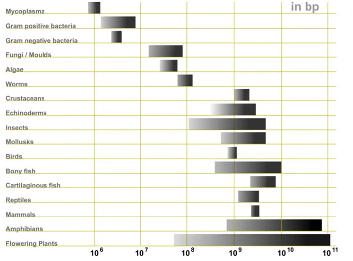
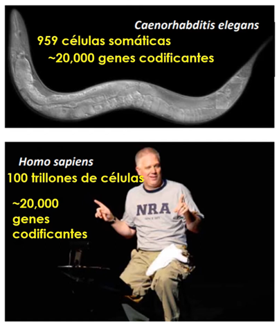
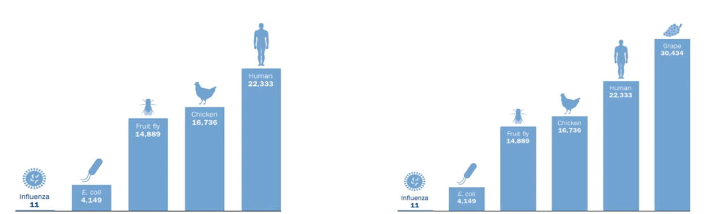
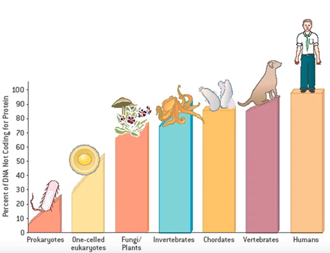

# Datos 

## Talla

La **talla del genoma** varía enormemente entre organismos, desde los millones de pares de bases de las bacterias hasta los cientos de miles de millones en algunas plantas o anfibios. Esta diversidad no se correlaciona directamente con la complejidad del organismo —un fenómeno conocido como la paradoja del valor C— y refleja la historia evolutiva, los procesos de duplicación génica y la presencia de secuencias no codificantes..

  
*Talla del Genoma medida en pares de bases*

## Genes codificantes

Estas imágenes comparan el número de **genes codificantes** en distintos organismos, mostrando que una mayor complejidad biológica no implica necesariamente un mayor número de genes. Así, aunque el ser humano tiene unos 22 000 genes, algunas plantas, como la vid (Vitis vinifera), superan los 30 000. Este hecho evidencia que la diversidad funcional depende también de la regulación génica, las interacciones y los mecanismos epigenéticos, no solo de la cantidad de genes.

  
*Genes codificantes*

El número de genes codificantes no está directamente relacionado con la complejidad o el número de células de un organismo.

  
*Comparativa de genes codificantes*

## Genes no codificantes

A medida que aumenta la complejidad de los organismos, también lo hace la proporción de ADN no codificante, es decir, regiones que no producen proteínas pero que desempeñan funciones esenciales en la regulación génica y la organización del genoma. En los humanos, más del 95 % del ADN no codifica proteínas, lo que resalta que la complejidad biológica depende tanto del control y expresión de los genes como de su número total.

  
*Comparativa de genes no codificantes*

## Conclusión
En conjunto, las imágenes muestran que la complejidad biológica no depende del tamaño del genoma ni del número de genes codificantes, sino de cómo se organiza y regula la información genética. Los organismos más evolucionados presentan una mayor proporción de ADN no codificante, reflejando la importancia de los mecanismos de control, interacción y regulación en la diversidad y funcionalidad de la vida.
