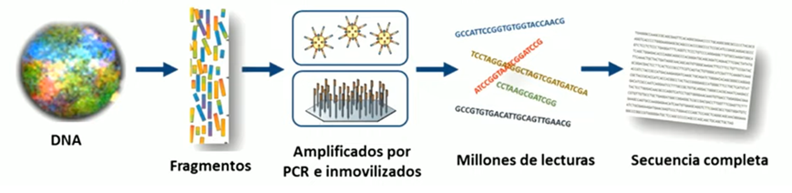
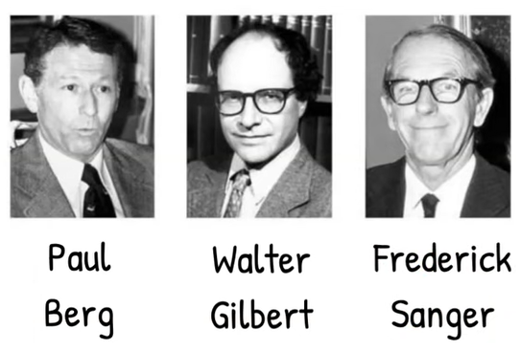

# Secuenciación
La secuenciación consiste en determinar el orden de los nucleótidos (adenina, timina, citosina y guanina en el ADN; adenina, uracilo, citosina y guanina en el ARN). Esta información es la base sobre la que se construyen la genómica, la transcriptómica y la biología de sistemas. Ninguna tecnología actual puede leer de una sola vez un genoma completo: todas requieren dividirlo en fragmentos, leerlos, y después ensamblarlos mediante algoritmos computacionales.

## Breves biografías de pioneros

- **Paul Berg (1926–2023)**: bioquímico estadounidense que desarrolló las técnicas de ADN recombinante, abriendo el camino para la ingeniería genética moderna. Fue galardonado con el Nobel en 1980. **Manipulación genética y obtención de una molécula de ADN recombinante constituida por fragmentos de ADN de diferentes especies.**  
- **Frederick Sanger (1918–2013)**: bioquímico británico, pionero en métodos de secuenciación de proteínas y ácidos nucleicos. Desarrolló el método de terminación de cadena que lleva su nombre y que revolucionó la biología molecular, por lo que recibió dos premios Nobel de Química. **Desarrollo de los primeros métodos de secuenciación del ADN.**

- **Walter Gilbert (1932–)**: físico y bioquímico estadounidense que codiseñó un método de secuenciación de ADN alternativo al de Sanger. También fue una de las primeras voces en proponer la idea de una secuenciación masiva del genoma humano.**Desarrollo de los primeros métodos de secuenciación del ADN.**

## Secuenciación de Sanger - Clásica (1977) 
El método de Sanger, introducido en 1977, se basa en el uso de dideoxinucleótidos que interrumpen la síntesis de ADN en posiciones específicas. Al separar los fragmentos resultantes por electroforesis y leer el patrón, es posible reconstruir la secuencia original. Durante más de dos décadas fue el método estándar, y gracias a él se completó el Proyecto Genoma Humano. Aunque hoy ha sido desplazado por tecnologías más rápidas y económicas, sigue siendo un método de referencia por su precisión.

[Secuenciación de Sanger](02_secuenciacionsanger.md)

## Secuenciación de nueva generación (NGS) (2005)
La NGS engloba un conjunto de tecnologías que permiten secuenciar millones de fragmentos en paralelo. Plataformas como Illumina o SOLiD han multiplicado exponencialmente la capacidad de generación de datos, reduciendo los costes drásticamente. Aunque las lecturas son más cortas que las obtenidas con Sanger, la combinación de volumen y algoritmos de ensamblaje ha hecho posible proyectos que antes eran impensables, como la secuenciación de metagenomas ambientales o la caracterización de la heterogeneidad tumoral. Hoy en día, la NGS es una herramienta central en investigación biomédica, clínica y biotecnológica.

[Secuenciación de Nueva Generación](02_secuenciacionng.md)

## Secuenciación de tercera generación (2010)
La secuenciación de tercera generación se caracteriza por la capacidad de leer moléculas individuales de ADN sin necesidad de amplificación por PCR, lo que reduce errores y permite obtener lecturas mucho más largas que en tecnologías anteriores. Plataformas como **PacBio (SMRT sequencing)** y **Oxford Nanopore Technologies (ONT)** han revolucionado el campo al generar lecturas de decenas de kilobases, llegando incluso a superar el millón de bases en un solo fragmento con Nanopore. Estas lecturas largas facilitan el ensamblaje de genomas complejos, la resolución de regiones repetitivas y el análisis de isoformas completas en transcriptómica. Aunque inicialmente presentaban mayores tasas de error.

[Secuenciación de Nueva Generación](02_secuenciacionng.md)

## Algoritmos de secuenciación

Los algoritmos de secuenciación son el puente entre los datos crudos obtenidos de los secuenciadores y el conocimiento biológico que extraemos de ellos. Como ninguna tecnología actual puede leer un genoma de una sola vez, los fragmentos generados deben ensamblarse mediante métodos computacionales que resuelvan solapamientos, errores y repeticiones. A lo largo de la historia han evolucionado desde enfoques simples y limitados hasta sofisticados grafos y estrategias híbridas que permiten reconstruir genomas completos. Su desarrollo es clave para que la bioinformática convierta grandes volúmenes de datos (secuencias) en información y ciencia.  

[Algoritmos de secuenciación](02_algoritmos_secuenciacion.md)

