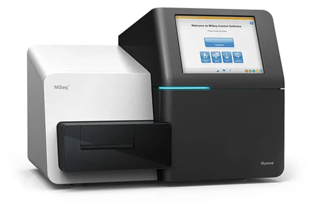
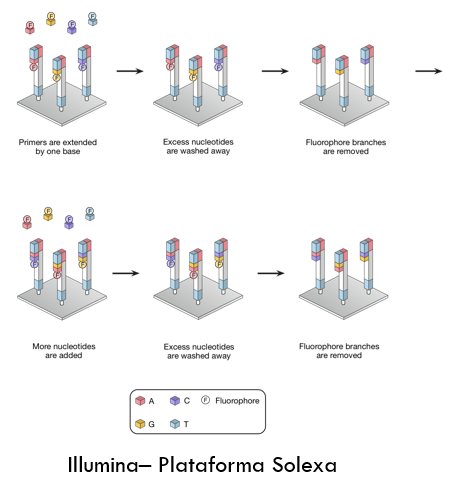
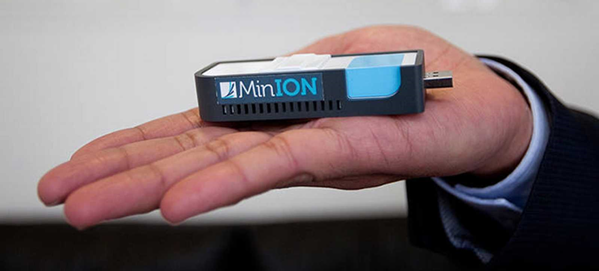
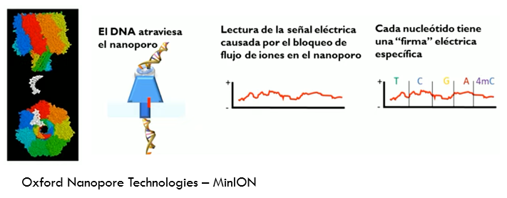

# Secuenciación de Nueva Generación
Este tipo de secuenciación permite secuenciar millones de fragmentos en paralelo. No se debe al trabajo de una sola persona como en el caso de Sanger sino al trabajo de varios grupos y empresas que, a mediados de los 2000, desarrollaron plataformas tecnológicas capaces de secuenciar en paralelo millones de fragmentos de ADN.

## Aunque sí podemos destacar algunos pioneros de la NGS

- **Jonathan Rothberg (1963–)**: ingeniero y emprendedor estadounidense, fundador de 454 Life Sciences. En 2005 lanzó la primera plataforma comercial de secuenciación masiva en paralelo (pirosecuenciación 454), considerada la primera tecnología de NGS. Su trabajo abrió la puerta a la secuenciación rápida de genomas completos y a la reducción drástica de los costes.

- **Shankar Balasubramanian (1966–)** y **David Klenerman (1959–)**: químicos británicos de la Universidad de Cambridge, coinventores de la tecnología de secuenciación por síntesis desarrollada en la empresa Solexa. Tras la adquisición de Solexa por Illumina en 2006, su innovación se convirtió en la plataforma más usada en NGS en todo el mundo. En 2020 recibieron el **Premio Millennium Technology Prize** por este avance fundamental.

### Secuenciación de Nueva Generación

  
*Ejemplo de plataforma de secuenciación de nueva generación (NGS). Estos equipos permiten secuenciar millones de fragmentos de ADN en paralelo de forma automatizada.*  
  
*Esquema del proceso de secuenciación por síntesis (Illumina/Solexa). Cada nucleótido incorporado lleva un fluoróforo distinto, lo que permite detectar en tiempo real el orden de las bases.*  

---

### Secuenciación de Tercera Generación

Se centra en leer moléculas individuales de ADN sin necesidad de amplificación por PCR.  

**PacBio (SMRT sequencing):** lecturas muy largas (10–30 kb, incluso más), útil para ensamblajes complejos.  
**Oxford Nanopore Technologies (ONT):** detecta cambios de corriente al pasar el ADN por un poro. Portátil (ej. MinION) y con lecturas ultra-largas (>1 Mb). 

**Aplicación:** resolución de genomas con regiones repetitivas, transcriptómica a nivel de isoformas, análisis rápido en campo.  

  
*Dispositivo portátil MinION de Oxford Nanopore Technologies. Permite secuenciar ADN en tiempo real y en condiciones de campo, sin necesidad de equipos de gran tamaño.*   

  
*Esquema del principio de secuenciación por nanoporos: el ADN atraviesa un poro biológico y cada nucleótido genera una señal eléctrica característica que permite identificar la secuencia*  