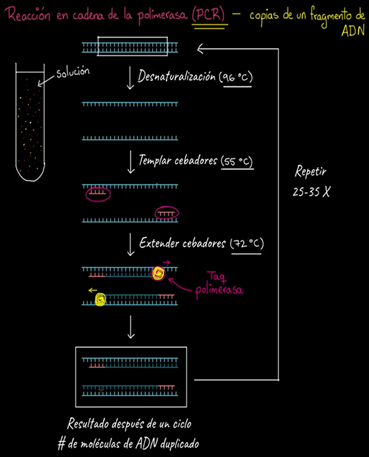
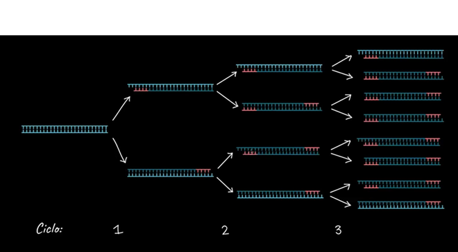
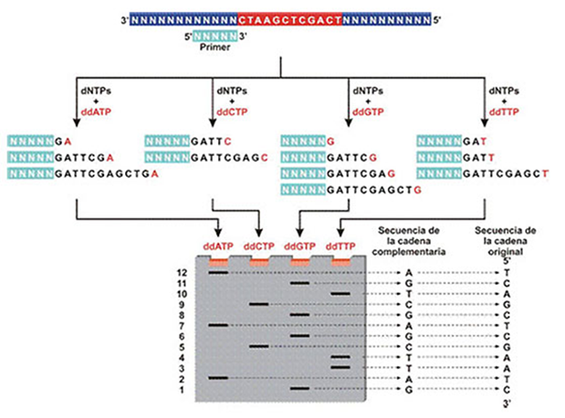
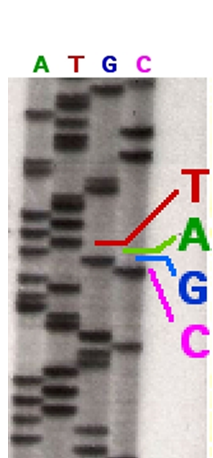
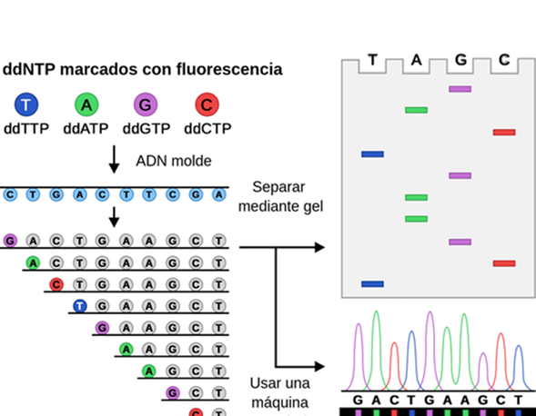
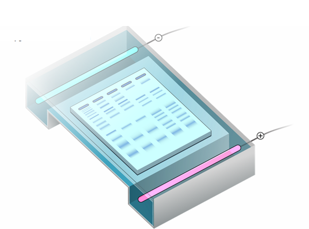
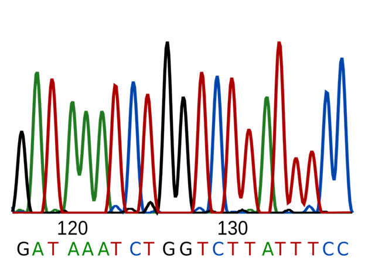

# Secuenciación de Sanger
La secuenciación de Sanger marcó un antes y un después en la biología molecular al permitir leer fragmentos de ADN con gran precisión. Su principio radica en generar copias de la molécula de interés, interrumpiendo la síntesis de forma controlada para identificar el orden de los nucleótidos. A pesar de haber sido superada por tecnologías más rápidas, aún hoy se utiliza en laboratorios para tareas de validación y análisis de pequeños fragmentos.

## Kary Banks Mullis (1944–2019)  
Kary Mullis fue un bioquímico estadounidense conocido por ser el inventor de la **reacción en cadena de la polimerasa (PCR)** en 1983, técnica que revolucionó la biología molecular. Gracias a la PCR, fue posible amplificar fragmentos de ADN de manera rápida y eficiente, lo que abrió el camino a múltiples aplicaciones en genética, medicina forense, diagnóstico clínico y biotecnología. En 1993 recibió el **Premio Nobel de Química** por este descubrimiento.

## La técnica de PCR  
La **PCR (Polymerase Chain Reaction)** es un método que permite obtener millones de copias de un fragmento específico de ADN a partir de una cantidad mínima inicial. Su funcionamiento se basa en ciclos repetidos de desnaturalización del ADN, hibridación de cebadores y extensión de nuevas hebras mediante una ADN polimerasa termoestable. Esta técnica es fundamental en bioinformática, investigación biomédica y diagnóstico molecular, al posibilitar el análisis genético de muestras muy pequeñas.

  
*Reacción en cadena de la polimerasa*  
  
*Reacción en cadena de la polimerasa. Ciclos*

---

  
*Proceso de secuenciación*  
  
*Proceso de secuenciación*  
  
*Proceso de secuenciación*  
  
*Proceso de secuenciación*  
  
*Proceso de secuenciación*  
