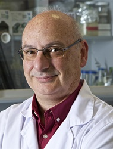

# Francisco Mojica y el origen del sistema CRISPR-Cas

## Biografía corta 

Francisco Juan Martínez Mojica (Elche, 1963) es un microbiólogo español reconocido por haber descubierto las **secuencias CRISPR** (*Clustered Regularly Interspaced Short Palindromic Repeats*) mientras estudiaba arqueas halófilas en las salinas de Santa Pola. Su observación, publicada en la década de 1990, reveló la existencia de repeticiones palindrómicas en el ADN que más tarde se entenderían como la base de un mecanismo inmunitario bacteriano frente a virus.

La trascendencia de su trabajo fue inicialmente pasada por alto, pero años después se convirtió en el pilar sobre el que se desarrolló la herramienta **CRISPR-Cas9**, capaz de **editar genes con precisión, eficiencia y bajo coste**. Este avance marcó una nueva era en biología molecular, biotecnología y medicina.

---

## Introducción: de la observación a la revolución

El descubrimiento del sistema **CRISPR-Cas** es un ejemplo fascinante de cómo una observación básica en microbiología puede transformar toda la biología moderna.  
Durante la década de 1990, **Francisco Mojica**, microbiólogo en la Universidad de Alicante, estudiaba arqueas halófilas que vivían en condiciones extremas de salinidad.  
En sus análisis identificó una serie de **repeticiones palindrómicas cortas y regularmente espaciadas** en el ADN de estos microorganismos, un patrón que no se había descrito antes.

Intrigado por su función, Mojica propuso años más tarde que estas secuencias podían formar parte de un **sistema inmunitario adaptativo** en bacterias y arqueas, capaz de reconocer y defenderse frente a infecciones virales.  
Aunque su hipótesis tardó en ser aceptada, sentó las bases para comprender uno de los mecanismos moleculares más ingeniosos de la naturaleza: un sistema capaz de **almacenar información genética de virus y reutilizarla como defensa**, principio que daría lugar a la tecnología de **edición génica CRISPR-Cas**.

## El sistema CRISPR-Cas

El sistema **CRISPR-Cas** funciona como un **mecanismo inmunitario adaptativo** en bacterias y arqueas, que les permite reconocer y destruir material genético extraño, como el de virus o plásmidos.  
Está formado por dos componentes principales: las **secuencias CRISPR**, que almacenan fragmentos de ADN invasor, y las **proteínas Cas** (*CRISPR-associated*), que utilizan esa información para identificar y cortar el ADN invasor cuando vuelve a aparecer.

### Estructura del sistema
- **Región CRISPR:** contiene repeticiones cortas de ADN separadas por espaciadores únicos. Cada espaciador proviene de un fragmento de ADN viral que la célula ha encontrado previamente, actuando como una “memoria genética” de infecciones pasadas.  
- **Genes Cas:** codifican proteínas con funciones en la adquisición, procesamiento y destrucción de ADN extraño. Entre ellas, la más conocida es **Cas9**, una nucleasa capaz de cortar el ADN en posiciones específicas.

### Funcionamiento
El proceso natural del sistema CRISPR-Cas puede dividirse en tres fases:  

1. **Adquisición:** cuando la célula se enfrenta a un virus, incorpora fragmentos de su ADN como nuevos espaciadores en la región CRISPR.    
2. **Expresión:** las repeticiones y espaciadores se transcriben en moléculas de ARN (crRNA) que contienen la secuencia complementaria al ADN viral.    
3. **Interferencia:** el ARN guía (crRNA) forma un complejo con la proteína Cas, que reconoce el ADN invasor y lo corta, neutralizando la amenaza.  

Este sistema proporciona una **inmunidad adaptativa** en organismos procariotas, análoga en concepto a la memoria inmunológica de los vertebrados, pero basada en información genética almacenada y reutilizada con precisión molecular.

[Sistema de Inmunidad Adaptativa](03_sia.md "Sistema de Inmunidad Adaptativa")

## De mecanismo bacteriano a herramienta biotecnológica

El paso decisivo en la historia de **CRISPR-Cas** llegó cuando los científicos comprendieron que el mecanismo bacteriano podía **reprogramarse** para funcionar en cualquier organismo.  
En 2012, los equipos de **Jennifer Doudna** y **Emmanuelle Charpentier** demostraron que era posible diseñar un **ARN guía sintético (sgRNA)** capaz de dirigir a la nucleasa **Cas9** hacia una secuencia específica de ADN.  
Esta combinación permitía **cortar el ADN en un punto exacto** elegido por el investigador, abriendo la puerta a la **edición genética precisa**.

La versatilidad de esta herramienta reside en su sencillez: basta con modificar la secuencia del ARN guía para dirigir Cas9 hacia un nuevo objetivo.  
Una vez producido el corte en el ADN, las propias enzimas de reparación de la célula pueden introducir **mutaciones controladas**, **eliminar fragmentos** o **insertar secuencias nuevas**.  
De este modo, CRISPR-Cas9 se convirtió en una herramienta **universal, barata y eficaz** para manipular el genoma de bacterias, plantas, animales e incluso células humanas.

Este avance transformó la biología molecular en una disciplina **no solo descriptiva, sino también de ingeniería genética**, dando origen a una nueva era de la biotecnología moderna.

## CRISPR y la expresión génica

Además de servir como herramienta de edición del ADN, el sistema **CRISPR-Cas** se ha adaptado para estudiar y controlar la **expresión génica** sin necesidad de modificar la secuencia del genoma.  
Cuando la proteína **Cas9** se modifica para perder su capacidad de corte —creando una versión inactiva llamada **dCas9 (dead Cas9)**—, esta puede dirigirse a regiones específicas del ADN mediante un ARN guía, actuando como un **regulador de la transcripción**.

Según las moléculas que se acoplen a dCas9, el sistema puede:
- **Activar genes (CRISPRa)**: uniendo factores que favorecen la transcripción, se estimula la expresión de un gen concreto.  
- **Reprimir genes (CRISPRi)**: bloqueando el acceso de la ARN polimerasa o reclutando represores, se reduce o impide la transcripción.

Estas variantes convierten a CRISPR en una **herramienta de control fino de la expresión génica**, con aplicaciones directas en transcriptómica funcional, biología sintética y estudios de regulación génica.  
En esencia, permiten observar cómo cambia el comportamiento celular al encender o apagar genes específicos, proporcionando una visión experimental y dinámica de la red de expresión génica.

## Aplicaciones actuales y futuras

El sistema **CRISPR-Cas** ha revolucionado la investigación biomédica y biotecnológica gracias a su simplicidad, precisión y versatilidad.  
Hoy en día, se utiliza en una amplia variedad de campos, desde la medicina hasta la agricultura y la biología sintética.

En **biomedicina**, CRISPR se emplea para **corregir mutaciones genéticas** responsables de enfermedades hereditarias, desarrollar **terapias génicas personalizadas** y crear modelos celulares y animales que reproducen patologías humanas con gran fidelidad.  
También se explora su uso en la **inmunoterapia contra el cáncer**, modificando linfocitos T para mejorar su capacidad de reconocimiento y destrucción de células tumorales.

En **biotecnología y agricultura**, se aplica para **optimizar cultivos**, aumentar su resistencia a enfermedades o mejorar sus propiedades nutricionales sin introducir ADN de otras especies.  
En el ámbito de la **investigación básica**, CRISPR permite estudiar la función de los genes mediante su activación o silenciamiento dirigido, acelerando la comprensión de las redes de regulación génica y los procesos celulares.

A futuro, se espera que las nuevas generaciones de herramientas basadas en CRISPR —como **Cas12, Cas13 o base editors**— amplíen aún más su alcance, permitiendo editar ARN, corregir mutaciones puntuales sin cortar el ADN o realizar modificaciones reversibles y controladas en el tiempo.

## Impacto y reconocimiento

El descubrimiento del sistema **CRISPR-Cas** y su posterior desarrollo como herramienta de edición génica han tenido un impacto profundo en la biología moderna.  
Gracias al trabajo pionero de **Francisco Mojica**, se comprendió que los microorganismos poseen un mecanismo de defensa programable basado en información genética, una idea que transformó la forma de entender la interacción entre virus y bacterias.

Aunque su hallazgo fue inicialmente ignorado por la comunidad científica, con el tiempo se reconoció su importancia fundamental.  
El trabajo de Mojica fue el punto de partida para los estudios que llevaron a **Jennifer Doudna y Emmanuelle Charpentier** a desarrollar la versión experimental de **CRISPR-Cas9**, por la que recibieron el **Premio Nobel de Química en 2020**.  
El propio Mojica ha sido posteriormente galardonado con múltiples premios internacionales y es considerado el **descubridor conceptual del sistema**.

Más allá del reconocimiento individual, CRISPR representa un ejemplo de cómo un descubrimiento básico puede trascender fronteras y convertirse en una **herramienta universal** con implicaciones éticas, médicas y tecnológicas.  
Hoy, el legado de Mojica se refleja en cada laboratorio que utiliza CRISPR para **entender, reparar o rediseñar** el material genético de los seres vivos.

## Conclusión

El sistema **CRISPR-Cas** simboliza la unión entre el descubrimiento biológico fundamental y la aplicación tecnológica más transformadora de nuestro tiempo.  
De un mecanismo natural de defensa microbiana surgió una herramienta que permite **editar, regular y comprender la expresión génica** con una precisión sin precedentes.  
El trabajo de Francisco Mojica demuestra que la curiosidad científica y la observación rigurosa pueden abrir caminos que cambian la historia de la ciencia y la forma en que la humanidad interactúa con su propio genoma.

---
