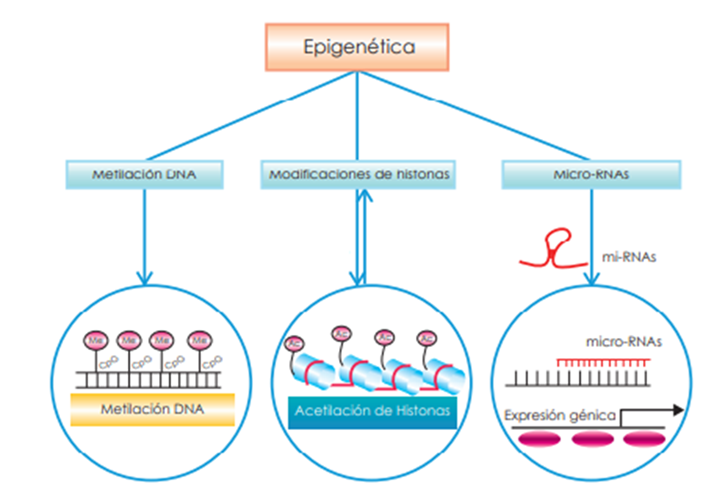

# Epigenética

## Introducción: más allá de la secuencia del ADN  
La **epigenética** estudia los cambios heredables en la expresión génica que no implican alteraciones en la secuencia del ADN.  
Estos mecanismos permiten que células con el mismo genoma adopten funciones y fenotipos distintos.  
El concepto fue propuesto originalmente por **Conrad Waddington**, quien describió el “paisaje epigenético” para representar la capacidad de una célula de diferenciarse en múltiples destinos posibles.  
En términos metafóricos, si el ADN es el texto, la epigenética es la puntuación y el formato que determinan cómo se lee y cuándo se interpreta.  

---

## Fundamentos moleculares de la regulación epigenética  

### Metilación del ADN  
La **metilación del ADN** consiste en la adición de grupos metilo (–CH₃) sobre las citosinas en regiones CpG.  
Esta modificación química no altera la secuencia, pero **bloquea la unión de factores de transcripción** y suele asociarse con el **silenciamiento génico**.  
Las enzimas responsables son las **ADN metiltransferasas (DNMTs)**, entre ellas DNMT1, DNMT3A y DNMT3B.  
La metilación cumple funciones esenciales en el desarrollo embrionario, la impronta genómica y la inactivación del cromosoma X.  

### Modificaciones de histonas  
Las histonas, proteínas alrededor de las cuales se enrolla el ADN, pueden modificarse químicamente mediante **acetilación, metilación, fosforilación o ubiquitinación**.  
Estas marcas determinan el grado de compactación de la cromatina:  
- La **acetilación** generalmente **activa la transcripción**, relajando la estructura del ADN.  
- La **desacetilación** o ciertas metilaciones **la reprimen**, condensando la cromatina.  
El conjunto de estas marcas forma el llamado **“código de histonas”**, que regula la expresión génica de manera dinámica.  

### microARNs (miRNAs) y control post-transcripcional  
Los **microARNs (miRNAs)** son pequeñas moléculas de ARN no codificante (~22 nucleótidos) que se unen de forma complementaria a los **ARN mensajeros (mRNA)**.  
Su acción impide la traducción del mRNA o promueve su degradación, modulando la **expresión génica post-transcripcional**.  
Este mecanismo permite un control fino y reversible de la producción de proteínas, y es fundamental en procesos como el desarrollo, la diferenciación celular o la respuesta al estrés.  

---

*Regulación Epigenética*

---

 Detalles

El estudio de estos mecanismos es conocido como epigenética. Se realiza colocando moléculas químicas en zonas muy concretas de la molécula de ADN que facilita que los genes se activen o desactiven.

Son marcas químicas que cambian la forma en la que se lee el ADN, pero sin alterar su secuencia, que sigue siendo la misma.

Por ejemplo, imagina la frase: 

No está mal el resultado

No. Está mal el resultado

¡No! Está mal el resultado

---

## Herencia epigenética y reprogramación celular  
- Las marcas epigenéticas pueden **transmitirse durante la división celular**, manteniendo la identidad funcional.  
- En etapas tempranas del desarrollo embrionario, ocurre una **reprogramación epigenética global** que borra y restablece estas marcas.  
- Se ha descrito **herencia epigenética transgeneracional**, donde ciertas modificaciones persisten entre generaciones sin alterar el ADN.  

---

## Epigenética y expresión génica  
La epigenética actúa como un nivel adicional de regulación sobre el genoma.  
Las marcas epigenéticas determinan qué regiones del ADN son accesibles a los **factores de transcripción** y, por tanto, si un gen se expresa o se mantiene silenciado.  
Los **ARN no codificantes**, como los microARN y lncRNA, también participan en esta regulación, estableciendo circuitos epigenéticos complejos.  

---

## Herramientas y tecnologías en epigenómica  

### Técnicas experimentales  
- **Bisulfite sequencing (BS-seq):** analiza la metilación del ADN a nivel de nucleótido.  
- **ChIP-seq:** identifica regiones de unión de proteínas, histonas modificadas o factores de transcripción.  
- **ATAC-seq y DNase-seq:** evalúan la accesibilidad de la cromatina.  

### Análisis bioinformático  
- Procesamiento de datos de metilación y enriquecimiento de regiones reguladoras.  
- Integración multi-ómica entre metilación, histonas y expresión génica.  
- Bases de datos epigenómicas relevantes: **ENCODE**, **Roadmap Epigenomics**, **GEO**.  

---

## Aplicaciones biomédicas de la epigenética  
- **Epigenética del cáncer:** hipometilación global y silenciamiento de genes supresores de tumores.  
- **Epigenética del envejecimiento:** aparición de los llamados “**relojes epigenéticos**” (Horvath clock).  
- **Terapias epigenéticas:** inhibidores de DNMT y HDAC como tratamientos antitumorales.  
- **Nutriepigenómica y ambiente:** cómo factores externos como dieta o estrés influyen en el epigenoma.  

---

## Epigenética computacional y ciencia de datos  
- Aplicación de **machine learning** para predecir patrones epigenéticos y regiones reguladoras activas.  
- Integración de datos epigenómicos en modelos multi-ómicos para inferir redes de regulación génica.  
- Visualización de marcas epigenéticas en **browsers genómicos** como UCSC Genome Browser o IGV.  

---

## Perspectivas futuras  
- **Single-cell epigenomics:** permite analizar la variabilidad epigenética entre células individuales.  
- **Edición epigenética:** uso de CRISPR-dCas9 fusionado a enzimas epigenéticas para modificar metilaciones o acetilaciones específicas.  
- Consideraciones éticas sobre la manipulación epigenética y su posible herencia transgeneracional.  

---

## Conclusión  
La epigenética amplía la genética clásica al incorporar un nivel de regulación dinámico, reversible y sensible al entorno.  
Su integración con la bioinformática y la ciencia de datos está revelando cómo el epigenoma conecta el ambiente con la función celular, aportando claves esenciales para la medicina personalizada y la biología de sistemas.  

---
