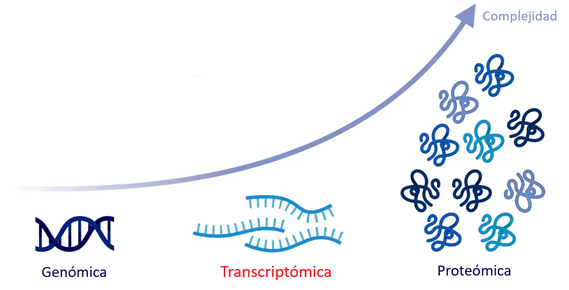
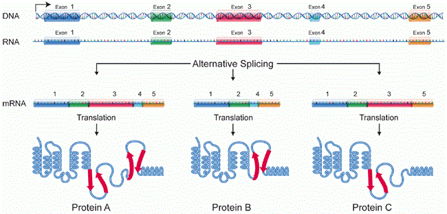
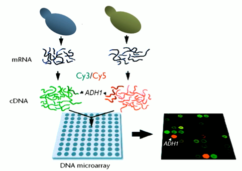
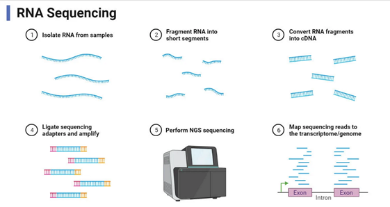
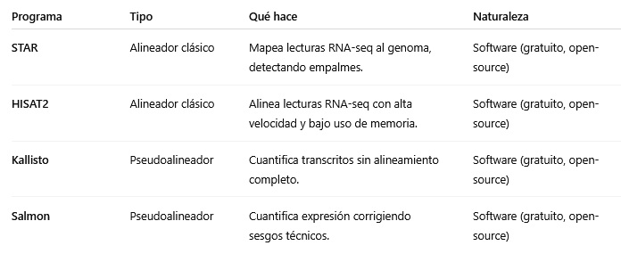

# Expresión génica y transcriptómica

La expresión génica es el proceso mediante el cual la información contenida en el ADN se traduce en productos funcionales —principalmente proteínas— que determinan el fenotipo y las funciones celulares. La transcriptómica, por su parte, estudia el conjunto completo de moléculas de ARN presentes en una célula o tejido (el transcriptoma) y permite cuantificar cómo se modula la actividad de los genes bajo diferentes condiciones.

---

## Introducción: del genoma al transcriptoma

Aunque el genoma representa la secuencia estática de un organismo, el transcriptoma refleja su estado dinámico: qué genes están activos, en qué cantidad y en qué contexto. Analizar el transcriptoma permite entender procesos celulares, estados de diferenciación, respuestas a estímulos o enfermedades.

La bioinformática es esencial en este ámbito, ya que la cantidad de datos generados por experimentos transcriptómicos —especialmente RNA‑seq— requiere pipelines robustos para su procesamiento, análisis estadístico y visualización.

---

## Transcripción: el proceso molecular

La **transcripción** es el primer paso en la expresión génica. En ella, la **ARN polimerasa** copia la información del ADN en una molécula complementaria de ARN.

### ARN polimerasas y factores de transcripción
En organismos eucariotas existen tres ARN polimerasas principales:   
- **ARN polimerasa I**: transcribe ARN ribosómico (rRNA).  
- **ARN polimerasa II**: produce ARN mensajero (mRNA) y algunos ARN no codificantes.  
- **ARN polimerasa III**: sintetiza ARN de transferencia (tRNA) y otros pequeños ARN.  

La unión de la polimerasa a los **promotores** requiere proteínas reguladoras denominadas **factores de transcripción**, que pueden activar o reprimir la transcripción según las señales celulares.

### Promotores, enhancers y regulación cis/trans
Los **promotores** son regiones próximas al gen que determinan dónde inicia la transcripción.  
Los **enhancers** (potenciadores) son secuencias distales que aumentan la eficiencia de transcripción mediante la interacción con factores de transcripción específicos.  
La regulación **cis** depende de elementos situados en la misma molécula de ADN, mientras que la **trans** involucra factores difusibles como proteínas o ARN.

 Detalles

<strong> Regulación cis</strong> en el mismo lugar

Son secuencias de ADN que regulan genes cercanos, normalmente situadas en la misma molécula de ADN que el gen que controlan.

Actúan como interruptores locales

<strong> Regulación trans</strong> a distancia

Son factores difusibles, casi siempre proteínas o ARN, que pueden moverse por la célula y actuar sobre múltiples genes (incluso en distintos cromosomas).

Actúan como mensajeros globales

### Fases de la transcripción
1. **Iniciación**: la polimerasa se une al promotor y comienza la síntesis.
2. **Elongación**: la enzima avanza añadiendo ribonucleótidos complementarios.
3. **Terminación**: se libera la cadena de ARN naciente.

---

## Procesamiento del ARN

En eucariotas, el ARN primario (pre‑mRNA) sufre varios pasos de maduración antes de traducirse:

- **Capping**: adición de una caperuza en el extremo 5’ que protege al ARN y facilita su reconocimiento ribosomal.
- **Poliadenilación**: adición de una cola poli‑A en el extremo 3’.
- **Splicing**: eliminación de intrones y unión de exones.

### Splicing alternativo
Permite que un mismo gen genere múltiples isoformas de ARN y proteínas, aumentando la diversidad funcional sin necesidad de nuevos genes. Este proceso está regulado por proteínas SR y hnRNP y constituye un nivel clave de control en la expresión génica.

---

*Splicing alternativo*

---

### Edición de ARN y modificaciones post‑transcripcionales
Algunos ARNm se editan químicamente después de la transcripción (por ejemplo, conversión de adenosina en inosina), alterando su secuencia y función.

---

## Tipos de ARN

- **ARN mensajero (mRNA)**: lleva la información codificante para la síntesis de proteínas.  
- **ARN ribosómico (rRNA)**: forma parte estructural del ribosoma.  
- **ARN de transferencia (tRNA)**: transporta aminoácidos durante la traducción.  
- **microARN (miRNA)** y **siRNA**: regulan la expresión post‑transcripcional uniéndose a ARNm diana.  
- **lncRNA (long non‑coding RNA)**: implicados en regulación epigenética y estructural.  
- **circRNA (circular RNA)**: moléculas con funciones regulatorias emergentes.

---

## Niveles de regulación de la expresión

La regulación de la expresión génica permite que las células controlen qué genes se activan, en qué momento y en qué cantidad, adaptando así su función a las necesidades del organismo. Este control puede ejercerse en distintos niveles: durante la transcripción (decidiendo si un gen se copia a ARN), tras la transcripción (modulando la estabilidad o el procesamiento del ARN) y en la traducción o después de ella, ajustando la producción o la actividad de las proteínas resultantes-

---

## Transcriptómica: cuantificación de la expresión génica

La transcriptómica engloba las técnicas que permiten medir la abundancia de ARNm a escala global.

### Microarrays
Los microarrays son láminas o chips (generalmente de vidrio o silicio) que contienen miles de sondas de ADN fijadas en puntos microscópicos organizados en una cuadrícula.
Cada sonda corresponde a un gen conocido. Para medir la expresión génica, el ARN de una muestra biológica se extrae, se convierte en ADN complementario (ADNc), se marca con un color fluorescente y se hibrida sobre el chip.
Cuanta más fluorescencia se detecta en un punto, mayor es la cantidad de ARN del gen correspondiente en la muestra.

*Microarray*

### RNA‑seq
Secuenciación masiva de los transcritos presentes en una muestra.  
1. Extracción de ARN total.  
2. Conversión a ADNc (complementario).  
3. Fragmentación y secuenciación.  
4. Alineamiento de las lecturas al genoma o transcriptoma de referencia.  
5. Cuantificación de la expresión génica.  

RNA‑seq ofrece alta sensibilidad, detección de isoformas y posibilidad de descubrir transcritos nuevos.

*Secuenciación Masiva de ARN*

---

## Procesamiento bioinformático de datos RNA‑seq

El análisis de RNA‑seq implica varias etapas sucesivas:

### Control de calidad
Herramientas como **FastQC** o **MultiQC** evalúan la calidad de las lecturas. El recorte (trimming) elimina adaptadores y bases de baja calidad.

 FastQC

Es un programa informático gratuito y de código abierto, desarrollado por Babraham Bioinformatics (Reino Unido).

Toma como entrada archivos de secuencias crudas (.fastq) generados por las máquinas de secuenciación (Illumina, Nanopore, etc.).

Genera como salida un informe HTML con gráficos y estadísticas de calidad.

 MultiQC

Es un programa de software libre desarrollado por Phil Ewels y colaboradores del SciLifeLab (Suecia). Está publicado bajo una licencia MIT, lo que significa que cualquier persona puede usarlo, modificarlo y distribuirlo libremente.

Toma como entrada archivos de secuencias crudas (.fastq) generados por las máquinas de secuenciación (Illumina, Nanopore, etc.).

Analiza las lecturas, sino los informes generados por otros programas (como FastQC, STAR, HISAT2, Salmon…) y los combina en un resumen conjunto.

### Alineamiento o pseudoalineamiento

- **Alineadores clásicos**: Su función es comparar las lecturas de secuenciación (los fragmentos de ARN convertidos a ADNc) con una secuencia de referencia (un genoma o transcriptoma), para determinar de dónde proviene cada lectura. Alineadores: STAR, HISAT2.
- **Pseudoalineadores**: En el caso de los pseudoalineadores, el software no realiza una comparación exacta base a base, sino que usa métodos estadísticos y estructuras de datos eficientes para estimar rápidamente la abundancia de transcritos. Pseudoalineadores: Kallisto, Salmon.

Los segundos son más rápidos y adecuados para cuantificación directa.

*Comparativa alineadores-pseudoalineadores*

### Ensamblaje de transcriptoma
El ensamblaje de transcriptoma consiste en reconstruir las secuencias completas de los transcritos (ARNm) presentes en una muestra a partir de las lecturas cortas obtenidas por secuenciación. En lugar de analizar cada lectura individualmente, el ensamblaje busca recomponer las moléculas originales de ARN —es decir, los genes expresados y sus isoformas— uniendo las lecturas que se solapan entre sí.  

Existen dos enfoques principales. El ensamblaje **guiado** por referencia utiliza un genoma conocido para alinear las lecturas y reconstruir los transcritos con ayuda de la anotación existente. En cambio, el ensamblaje **de novo** se realiza sin una referencia previa, basándose solo en los solapamientos entre lecturas, lo que resulta esencial en organismos no modelados o con genomas incompletos. Ambos enfoques permiten obtener una visión global del transcriptoma, identificar nuevas isoformas y cuantificar la expresión génica de forma más completa.

### Cuantificación y matrices de expresión
La cuantificación en transcriptómica consiste en medir cuántas lecturas de secuenciación corresponden a cada gen o transcrito, lo que permite estimar su nivel de expresión. Dependiendo del enfoque, esta medición puede expresarse como recuentos brutos (número de lecturas asignadas a cada gen) o mediante valores normalizados, como FPKM, TPM o RPKM, que corrigen por la longitud del gen y la profundidad de secuenciación, haciendo los resultados comparables entre genes y entre muestras.

El resultado final se organiza en una matriz de expresión, donde las filas representan los genes o transcritos y las columnas las distintas muestras analizadas. Cada celda contiene el nivel de expresión estimado para un gen en una muestra determinada. Esta matriz es el punto de partida para la mayoría de los análisis bioinformáticos posteriores, como la detección de genes diferencialmente expresados, el análisis de coexpresión o la interpretación funcional mediante enriquecimiento de rutas biológicas.

[Matriz de Expresión Génica](03_matrizexpresiongenica.md "Matriz de Expresión Génica")

 Valores normalizados

<strong>FPKM (Reads Per Kilobase of transcript, per Million mapped reads)</strong>

Es la medida clásica para lecturas simples (single-end).
Se calcula dividiendo el número de lecturas asignadas a un gen entre la longitud del gen (en kilobases) y el total de lecturas mapeadas (en millones).

RPKM = (nº de lecturas / longitud del gen en kb) / (millones de lecturas totales).

Permite comparar genes dentro de una misma muestra, pero no siempre entre muestras diferentes.

<strong>FPKM (Fragments Per Kilobase of transcript, per Million mapped reads)</strong>

Es una variante del RPKM adaptada para lecturas pareadas (paired-end).

Cada par de lecturas se considera un único fragmento, evitando el doble conteo.

En la práctica: RPKM y FPKM son equivalentes, solo cambia la forma en que cuentan las lecturas.

<strong>TPM (Transcripts Per Million)</strong>

Es una versión más moderna y más coherente entre muestras.

Primero se normaliza por la longitud de los genes y luego se ajusta el total para que la suma de TPMs en cada muestra sea igual a un millón.

Esto hace que los TPM sean directamente comparables entre muestras, algo que no ocurre con RPKM/FPKM.

### Análisis de expresión diferencial
Métodos estadísticos (DESeq2, edgeR, limma‑voom) detectan genes cuya expresión cambia significativamente entre condiciones biológicas.

### Análisis funcional
Se identifican funciones biológicas asociadas mediante **enriquecimiento de términos GO**, **vías KEGG**, o análisis de conjuntos génicos (**GSEA**).

---

## Aplicaciones prácticas y casos de estudio

### Biomarcadores basados en transcriptómica
La comparación de perfiles de expresión entre tejidos sanos y tumorales permite descubrir **biomarcadores de diagnóstico y pronóstico**.

### Respuesta a estrés o estímulos
La transcriptómica ayuda a entender cómo las células responden a fármacos, infecciones o condiciones ambientales adversas.

### Single‑cell RNA‑seq
Permite estudiar la expresión génica célula a célula, revelando heterogeneidad celular, estados de diferenciación y trayectorias de desarrollo.

---

## Desafíos y limitaciones

- **Sesgos de mapeo y longitud de genes.**
- **Corrección de efectos de lote** (batch effect) entre experimentos.
- **Representación incompleta de isoformas.**
- **Genes de baja expresión o alta variabilidad técnica.**
- **Integración con otras ómicas** (epigenómica, proteómica, metabolómica).

---

## Perspectivas futuras

Las tecnologías de secuenciación de **lecturas largas** (Nanopore, PacBio Iso‑Seq) permiten capturar transcritos completos y distinguir isoformas con precisión.

La **transcriptómica espacial** combina la cuantificación de ARNm con la localización dentro del tejido, generando mapas tridimensionales de expresión.

Los modelos de **transcriptómica predictiva** integran machine learning para inferir redes de regulación génica o predecir respuestas terapéuticas.

---

## Conclusión

La expresión génica conecta la información estática del genoma con la dinámica funcional de las células. La transcriptómica, apoyada en herramientas bioinformáticas, permite descifrar esa dinámica con una resolución sin precedentes. Comprender cómo y cuándo se expresan los genes es clave para avanzar en biología de sistemas, medicina personalizada y biotecnología.

