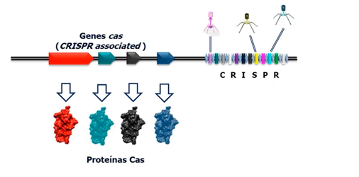
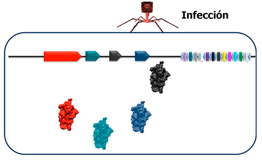
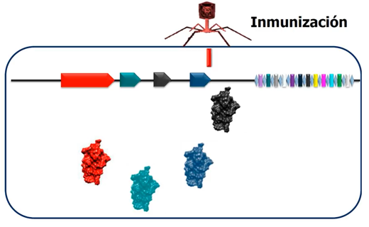
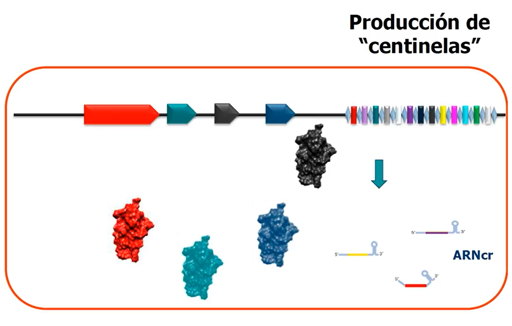
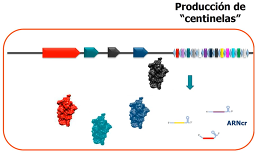
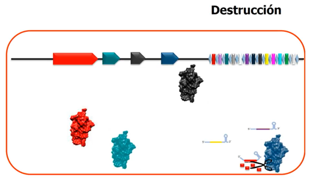

# Sistema de Inmunidad Adquirida

### 1. Sistema de inmunidad adquirida
Las bacterias y arqueas poseen un sistema inmunitario adaptativo basado en el conjunto de genes **cas** y las secuencias **CRISPR**. Estas regiones del ADN contienen fragmentos de material genético de virus que las han infectado anteriormente, funcionando como una **memoria molecular** que permite reconocer infecciones futuras.

### 2. Infección
Cuando un virus (bacteriófago) infecta la célula bacteriana, introduce su ADN en el interior. El sistema CRISPR detecta la presencia de este material genético extraño, iniciando el proceso de defensa. Las proteínas Cas se preparan para actuar y proteger a la célula del invasor.

### 3. Inmunización
Durante esta fase, la célula incorpora un fragmento del ADN viral dentro de la región CRISPR de su propio genoma. Este nuevo fragmento, llamado **espaciador**, se añade al final del conjunto de repeticiones, ampliando la memoria inmunológica del microorganismo.

### 4. Producción de "centinelas"
Cuando la región CRISPR se transcribe, se generan pequeñas moléculas de ARN llamadas **ARNcr (ARN CRISPR)**, que contienen la información de los espaciadores. Estos ARN funcionan como “centinelas” moleculares: guías que permiten reconocer secuencias virales si vuelven a aparecer.

### 5. Reconocimiento
Si el virus intenta infectar de nuevo, los ARNcr se aparean con su secuencia complementaria en el ADN invasor. Este reconocimiento específico desencadena la activación de las proteínas Cas, que se unen al complejo de ARN guía para localizar con precisión el objetivo.

### 6. Destrucción
Una vez identificado el ADN viral, las proteínas Cas —como **Cas9**— actúan cortando la molécula en el punto correspondiente, neutralizando la infección. De este modo, la célula destruye el material genético del virus y sobrevive, manteniendo su inmunidad frente a futuras exposiciones.

