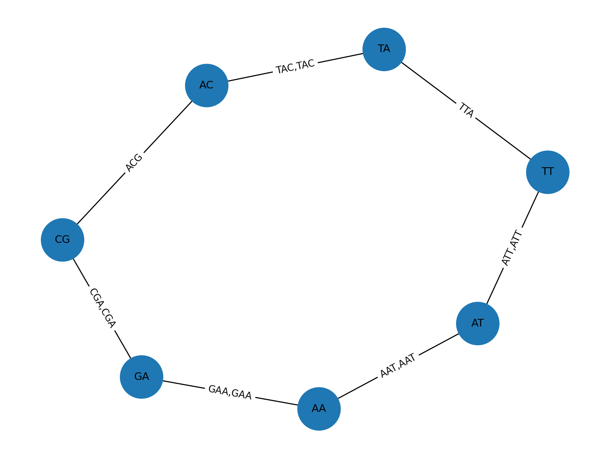

# Grafos de de Bruijn: ejemplo didáctico

En el ensamblaje con lecturas cortas (NGS), los **grafos de de Bruijn** son el estándar:
- **Nodos:** (k−1)-mers
- **Aristas dirigidas:** k-mers que conectan prefijo→sufijo
- **Objetivo:** hallar un **camino euleriano** (recorre cada arista una vez) y reconstruir el **contig**.

## 1) Construcción del grafo
A partir de las lecturas `["ATTAC", "TACGA", "CGAAT", "GAATT"]` y `k=3`, generamos k-mers y conectamos sus prefijos y sufijos.

> Las etiquetas de las aristas son los k-mers. La multiplicidad (si se repiten) queda recogida en el peso del borde.

## 2) Camino euleriano → contig
Si el grafo es **casi balanceado** (las diferencias entre grados de entrada/salida son compatibles con un camino), aplicamos Hierholzer para obtener un **camino euleriano** y reconstruimos el contig concatenando el primer nodo y el último carácter de cada nodo sucesivo.

- Ventajas: eficiencia en memoria/tiempo con millones de lecturas cortas.
- Retos: elección de `k`, corrección de errores (burbujas, tips), resolución de repeticiones.
- Extensiones modernas: **multi-k**, grafos dispersos (*sparse*), pangenomas en grafo.
