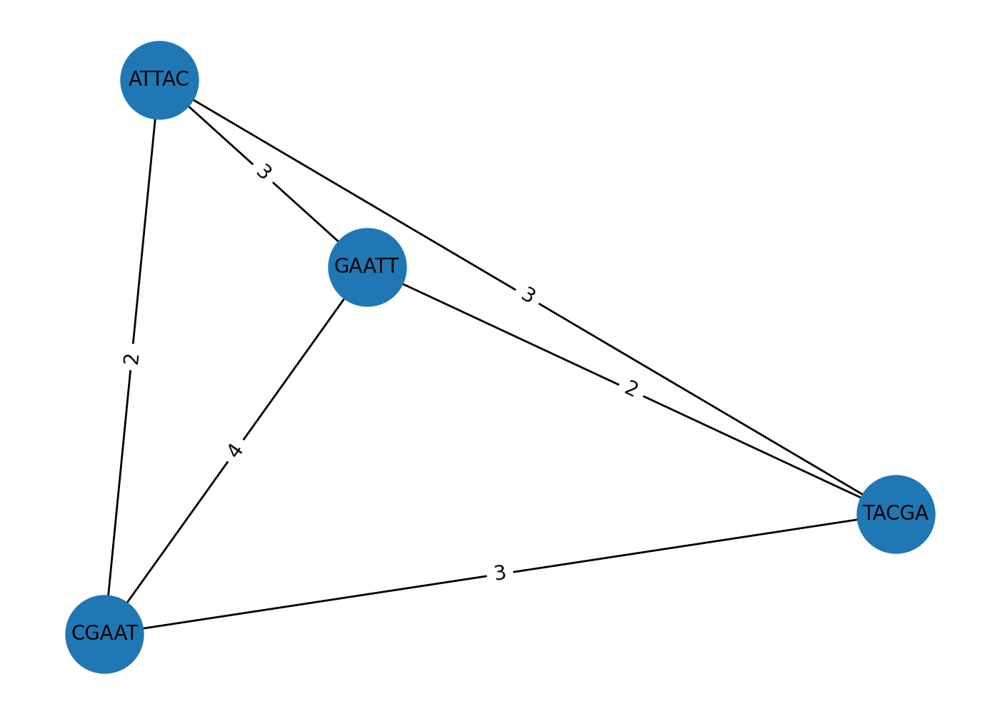

# Ensamblaje GREEDY: ejemplo didáctico

Este ejemplo muestra un pipeline **greedy** para ensamblar lecturas cortas, uniendo
siempre el **par con mayor solapamiento** hasta obtener una única secuencia.

## 1) Overlap (grafo de solapamientos)
Calculamos solapamientos pares a pares con `k=2` y construimos un grafo dirigido
(etiquetas = longitud del solapamiento).

> El algoritmo greedy selecciona en cada iteración **la arista con mayor peso**
> (mayor solapamiento), fusiona las dos lecturas y repite el proceso.

## 2) Layout implícito
A diferencia de OLC, aquí no construimos un *layout* global.
El orden emerge de las fusiones locales sucesivas.

## 3) Consenso (secuencia final)
Cada fusión respeta el solapamiento detectado. El resultado final es un
**superstring** que contiene todas las lecturas como subcadenas.
Este método es didáctico pero puede quedarse en soluciones subóptimas si hay
repeticiones o errores.

