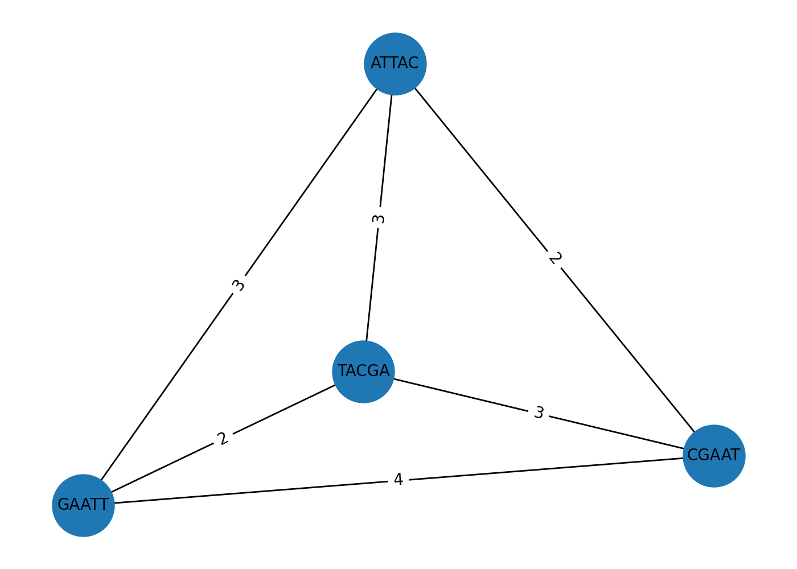

# Overlap–Layout–Consensus (OLC): ejemplo didáctico

Este ejemplo muestra el flujo **Overlap → Layout → Consensus** con cuatro lecturas de juguete y un umbral de solapamiento mínimo `k=2`.

## 1) Overlap (grafo de solapamientos)
Calculamos los solapamientos pares a pares y construimos un **grafo dirigido** donde cada nodo es una lectura y cada arista `a → b` está etiquetada con la longitud del solapamiento del final de `a` con el inicio de `b`.

> En este ejemplo, las aristas con pesos más altos sugieren el orden natural de las lecturas.

## 2) Layout (orden de lecturas)
A partir del grafo, elegimos un **camino razonable** (aproximado) priorizando las aristas con mayor peso y evitando ciclos. En un OLC real, esta fase suele implicar **string graphs**, filtrado de transitividad y heurísticas más robustas.

## 3) Consensus (secuencia final)
Fusionamos las lecturas en el orden del *layout* respetando los solapamientos para producir una **secuencia consenso**. En pipelines prácticos, se alinean las pilas de lecturas y se hace *polishing* (p.ej., **Pilon**, **Racon**).

