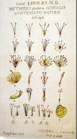
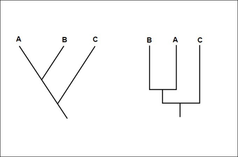
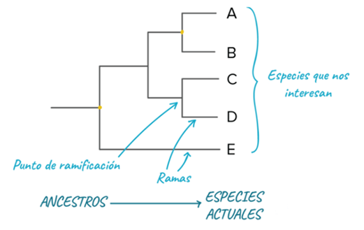
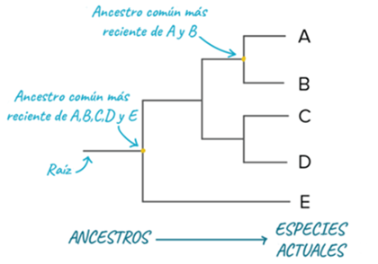

# Árboles Filogenéticos

Un **árbol filogenético** es una representación gráfica que muestra las **relaciones evolutivas** entre organismos, genes o especies, ilustrando cómo descienden de antepasados comunes y cómo se han ido diversificando a lo largo del tiempo.

Se utiliza para **reconstruir la historia evolutiva**, identificar linajes hermanos, estimar tiempos de divergencia, estudiar patrones de especiación y entender la distribución actual de los rasgos biológicos.

## Construcción de Árboles Filogenéticos (Conceptos Básicos)

### Carlos Linneo

Carlos Linneo (Carl von Linné, 1707–1778) fue un naturalista sueco considerado el padre de la taxonomía moderna. Desarrolló el sistema de nomenclatura binomial para nombrar especies y estableció una clasificación jerárquica de los seres vivos que aún hoy sirve de base para la biología. Su obra Systema Naturae transformó la manera de ordenar y describir la biodiversidad.
Fue el creador del sistema de clasificación binomial, precursor conceptual del enfoque filogenético actual.

*Carlos Linneo*

*Systema Naturae*

*Clasificación Systema Naturae*

### Dendrograma

Estructura arbórea que organiza elementos por similitud, muy utilizada también en machine learning (clustering jerárquico).
Representación gráfica o diagrama de datos en forma de árbol. Organiza los datos en subcategorías que se van dividiendo en otros hasta llegar al nivel de detalle deseado.

*Dendograma*

### Cladograma

Representa la estructura de ramificación sin escala temporal ni de distancia.
Es un diagrama ramificado usado en la cladística que esquematiza la filogenia, o historia evolutiva, más probable de un grupo de taxones terminales (los nodos terminales del cladograma), con base en cierta metodología fundada por el taxónomo Willi Hennig en 1950. El cladograma une taxones con su ascendencia común.

*Cladograma*

### Filograma

Además de la ramificación, muestra la longitud de ramas proporcional al cambio evolutivo.
Es un tipo, de cladograma (une especies, o géneros, o filos indicando el punto de convergencia a partir de un antepasado común). El filograma no solo muestra la relación evolutiva, en este caso el largo de la rama indica el tiempo en el que se produce el cambio. Lo puede indicar con la longitud de las líneas o con una línea adicional.

*Filograma*

### Interpretación de patrones

El patrón de ramificación en un árbol filogenético refleja cómo las especies u otros grupos evolucionaron a partir de una serie de ancestros comunes.

El patrón de ramificación indica:   
- Parentescos  
- Divergencias históricas  
- Eventos de especiación 

*Patrón de ramificación*

### Relación de parentesco

Dos especies están más relacionadas si tienen un ancestro común más reciente y menos relacionadas si tienen un ancestro común menos reciente.

*Relación de parentesco*

### Representaciones equivalentes

Los árboles filogenéticos pueden dibujarse en varios estilos equivalentes. Representan la misma información, pero de forma o estructura diferente.

*Ejemplos de topologías distintas que representan el mismo árbol filogenético: el orden de las ramas puede variar sin cambiar las relaciones evolutivas.*

Rotar un árbol alrededor de sus puntos de ramificación no cambia la información que contiene. Es la estructura de las ramas de cada diagrama la que nos indica qué necesitamos para entender el árbol.

*Distintas representaciones gráficas de un mismo árbol filogenético para los taxones A–E: aunque la disposición visual cambie, las relaciones evolutivas permanecen iguales.*

Estas representaciones **no cambian la información evolutiva**. La estructura, no el dibujo, es lo que importa.

### Politomías

Se da en los árboles filogenéticos que muestran un punto de ramificación con tres o más especies que surgen de él. En general, una politomía se muestra dónde no hay suficiente información para determinar el orden de las ramas.

*Politomías*

-   **Blandas:** Son el resultado de información filogenética insuficiente, aunque los linajes divergieron en diferentes momentos, lo que significa que algunos de ellos son parientes más cercanos que otros, los datos disponibles no permiten el reconocimiento de esto. La mayoría de las politomías son suaves, lo que significa que se resolverían en un árbol típico de dicotomías si hubiera mejores datos disponibles.

*Politomías Blandas*

-   **Duras:** Representan tres o más eventos de especiación simultáneos del mismo ancestro común, por lo que las especies hijas resultantes son equidistantes entre sí. En situaciones particulares pueden ser comunes, por ejemplo, cuando una especie que ha expandido rápidamente su rango o es altamente panmíctica sufre especiación peripátrica en diferentes regiones. 

*Politomías Duras* Fuente wikipedia

[Taxonomía](03_taxonomia.md "Taxonomía")
