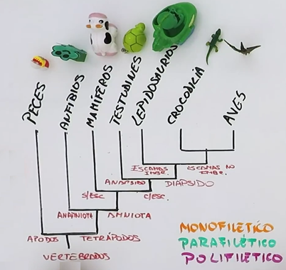
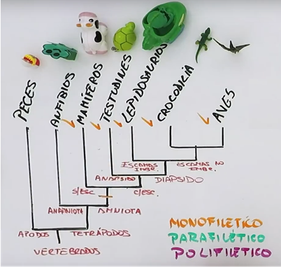

# Ejemplos

## Búsqueda de clados

*Árbol Filogenético*

## Amniotas

*Amniotas*

Monofilético

Incluye al ancestro común más reciente y todos los descendientes

---

## Tetrápodos

*Tetrápodos*

Parafilético

Incluye al ancestro común más reciente pero no todos los descendientes

---

## Homeotermos

*Homeotermos*

Polifilético

No incluye al ancestro común más reciente de todos los miembros

