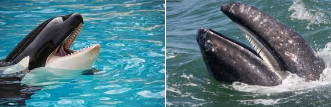

# Taxonomía 

La **taxonomía** es la ciencia que estudia los principios, métodos y reglas para clasificar organismos. Su objetivo es organizar la biodiversidad en un sistema jerárquico coherente.

## ¿Qué es la taxonomía?

-   Disciplina central en biología para ordenar la diversidad.
-   En filogenética moderna, la clasificación se basa en **origen común**, no únicamente en similitud morfológica.
-   Incluye:
    -   Identificación
    -   Nomenclatura
    -   Clasificación

## Categorías taxonómicas

Las categorías taxonómicas son los diferentes niveles en los que se clasifica a cada taxón y que comparten atributos observables. Siguen un orden jerárquico en el que las categorías más generales agrupan a un gran número de organismos emparentados evolutivamente, mientras que las más específicas contienen una cantidad menor de organismos, aunque con un mayor grado de parentesco evolutivo.

*Taxonomía. Categorías taxonomicas*

Ejemplo: *Panthera tigris*:

- Dominio: **Eukarya**   
- Reino: **Animalia**   
- Filo: **Chordata**   
- Clase: **Mammalia**   
- Orden: **Carnivora**  
- Familia: **Felidae**  
- Género: **Panthera**  
- Especie: **Panthera tigris**  

## Nomenclatura binomial

El nombre científico se escribe en cursiva:  
- Primer término: **género** (primera letra en mayúscula)  
- Segundo término: **especie** (siempre en minúscula)

Ej.: *Panthera leo*, *Homo sapiens*.

*Nomenclatura Binomial*

---

[Catálogo de la vida](https://www.catalogueoflife.org/)

---

## Clados y Agrupaciones Evolutivas

Un **clado** corresponde a una unidad de ascendencia evolutiva común e incluye a todos los descendientes de un determinado linaje ancestral. Dentro del grupo de estudio, los clados adoptan una disposición jerárquica en la que unos están incluidos en otros.

La relación puede tomar tres formas:

## Monofilia, Parafilia y Polifilia

### Taxón monofilético

-   Incluye al ancestro común más reciente y **todos los descendientes**.
-   Es la agrupación válida en filogenética moderna.

### Taxón parafilético

-   Incluye al ancestro común más reciente pero **no todos sus descendientes**.
-   Ejemplo típico: Reptilia sin incluir a las aves.

### Taxón polifilético

-   No incluye al ancestro común más reciente de todos los miembros. 
-   Agrupación artificial que debe evitarse.

*Tipos de Clados*

*Cladograma de los vertebrados. Fuente wikipedia*

---

## Fenómenos Evolutivos: Convergencia y Divergencia

### Convergencia

Se da cuando especies **sin un origen común reciente** presentan rasgos similares debido a **presiones ambientales semejantes**.   

Características convergentes:

- Alas para el vuelo   
- Estructuras óseas modificadas   
- Músculos y sistemas respiratorios adaptados   

*Características Convergentes en aves y murciélagos*

[Ejemplo](03_ejemploclado.md)

### Divergencia

Ocurre cuando especies con **un origen común** desarrollan características diferentes por adaptaciones distintas.

Características divergentes:

- Dientes  
- Ecolocalización  
- Agilidad   
- Picos    

*Características Divergentes en ballenas dentadas y barbadas*

### Ballenas barbadas

-   Se alimentan filtrando agua
-   Sin dientes en adultos
-   Grandes y lentas

---
## Parsimonia

La **parsimonia** es un principio metodológico que indica que, ante varias explicaciones posibles, la mejor es aquella que requiere **el menor número de cambios**.

En filogenética:
- El mejor árbol es el que necesita menos eventos evolutivos. Se basa en la simplicidad y en minimizar explicaciones innecesarias. Aunque ha sido desplazada por métodos como máxima verosimilitud y modelos bayesianos, sigue siendo una herramienta útil en:
- Datos morfológicos
- Enseñanza conceptual
- Construcción preliminar de hipótesis
